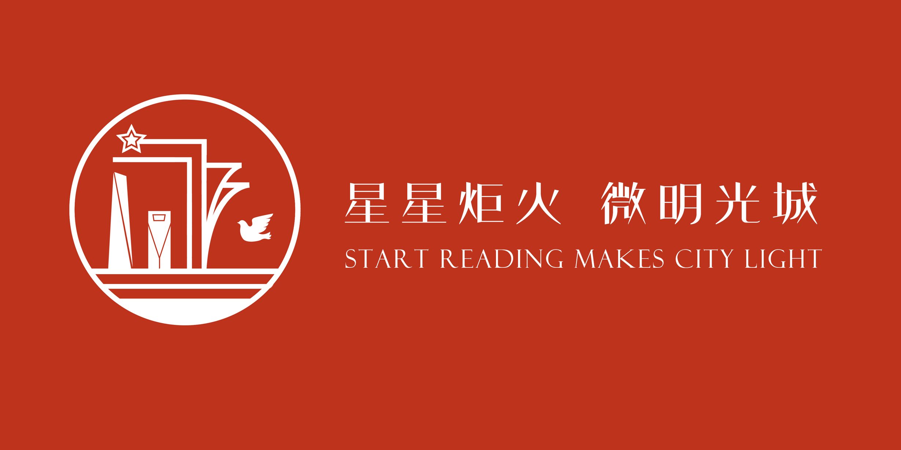

<figure markdown>
  
  <figcaption>团队LOGO</figcaption>
</figure>

# 和光同芥小队

取自：“和光同尘”与“生如芥子，心藏须弥。”

和光同尘：出自老子《道德经》，指不露锋芒，与世无争的处世态度。

生如芥子，心藏须弥：出自《祖堂集·归宗和尚》，指微小的芥子，容纳巨大的须弥山。

在此处芥子与尘同意义，取此两句作为队名的集合，代表着小队的成员每一位都有出色的才能但都是勤勤恳恳，兢兢业业的工作人员，大家相互协作聚合在一起，能够容纳巨山，和光一样明亮。

## 成员构成

我们团队既拥有大量的实干技术型的人才，又拥有文娱相关的组织型人才，合理调配我们的团队成员，推动我们项目对于红色文化阅读的宣传。

|  人员类型  | 人数  |
|  ----  | ----  |
| 媒体工作人员  | 8人 |
| 文案编辑人员  | 3人 |
| 计算机编程人员  | 2人 |
