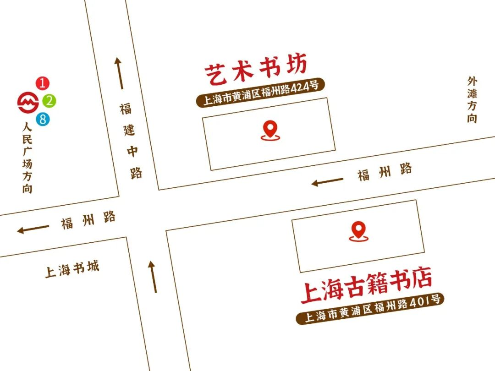
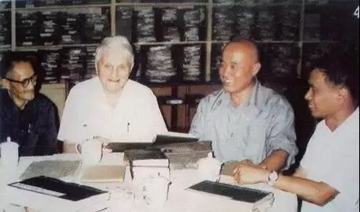
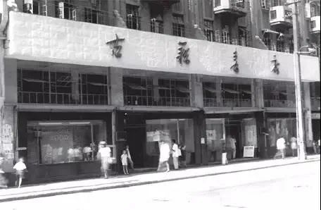
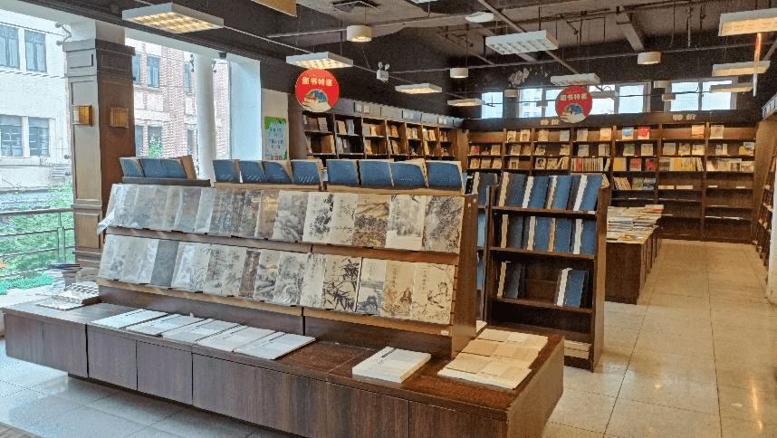
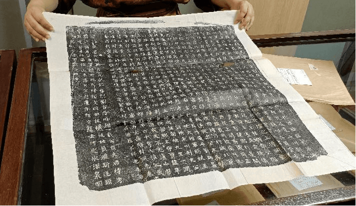
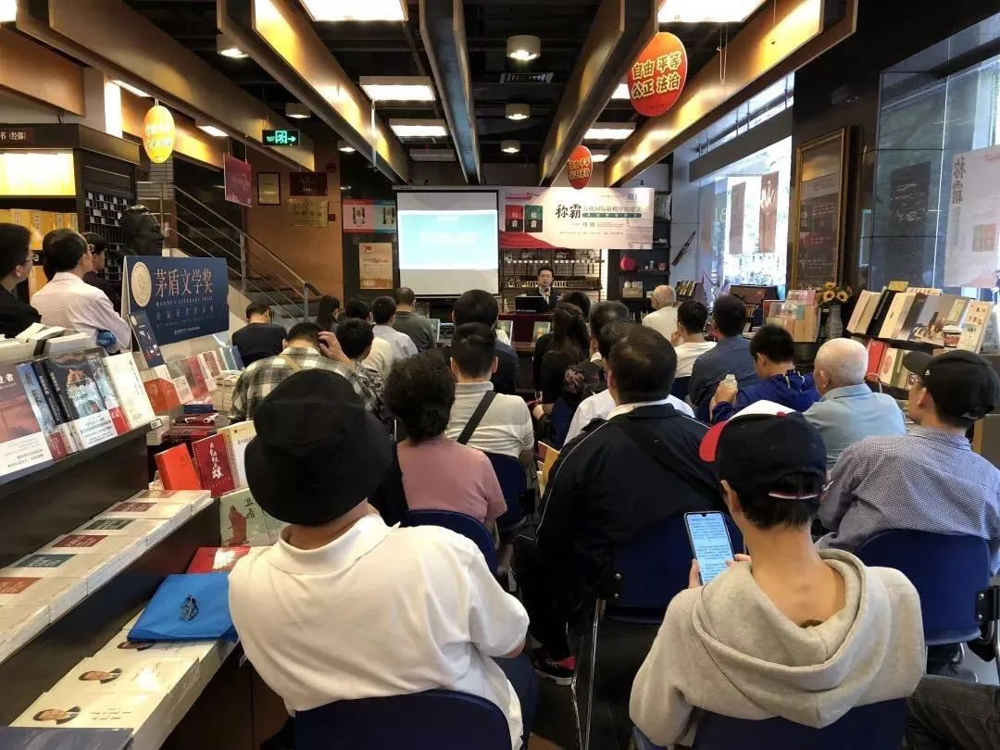
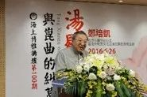

# 上海古籍书店

**上海古籍书店**诞生于1956年，是新中国成立以来上海最早的专业书店。书店主营历史典籍、史料研究、中医、民俗文化、藏学、敦煌学、新版线装书等专业图书六万余种，是上海地区品种最多、影响最大的学术、古籍类专业书店。它是被倾注了无数爱书人心血的精神栖息地，出现在上海的福州路。在随后的六十多年中，它犹如一座灯塔，安静地陪伴着一代代读书人，成为他们人生大海中那束引航的光芒。

<figure markdown>
  
  <figcaption>（图片来源于网络）</figcaption>
</figure>

#### 营业时间

>:alarm_clock:**时间**：周一到周日09:30-18:00

#### 地址交通

>:house:**地址**：上海市黄浦区福州路401号
>
>:tram:**地铁**：地铁1号线、8号线人民广场站15出口/地铁2号线、10号线南京东路站4号出口
>
>:bus:**公交**：福州路福建中路站（49路、123路、167路）

<figure markdown>
  
  <figcaption></figcaption>
</figure>

#### 联系方式

>:fontawesome-brands-weixin:{ .weixin }  **微信公众号**：上海图书有限公司、海上博雅讲坛、上海图书有限公司博古斋
>
>:telephone:**座机**：021-63360501

#### 历史背景

上海古籍书店诞生于1956年，是新中国成立以来上海最早的专业书店。

书店主营历史典籍、史料研究、古典小说、诗词曲赋、中医、考古、宗教、哲学、民俗文化、藏学、敦煌学、新版线装书等专业图书六万余种，是上海地区品种最多、影响最大的学术、古籍类专业书店。

为纪念古代思想家、政治家、教育家孔子，书店从2007年孔子诞辰日起，开始推出为期一个月的“国风古籍节”。 

“海上博雅讲坛”自2011年3月在上海古籍书店开办以来，迄今已举办两百多期文化活动。出席嘉宾既有业内专家学者，也有知名度极高的文化名人，主题涵盖中国文化、东方美学、人文社科、社会热点等；先后邀请扬之水、陈思和、陈子善、钱文忠、周振鹤、骆玉明、阮仪三、张大春、郦波、劳继雄、蔡澜、尔冬强等200多位学者名家举办讲座。

<figure markdown>
  
  <figcaption>胡道静（左一）与李约瑟（左二）</figcaption>
</figure>

<figure markdown>
  
  <figcaption>李敖</figcaption>
</figure>

1954年，上海图书公司前身——上海图书发行公司成立。

1956年5月，上海图书发行公司设立上海古籍书店，并在福州路424号开业。

1960年1月，上海古籍书店、上海古旧书店等多家单位合并成立上海图书公司（现上海图书有限公司）。

1999年2月，经国家新闻出版署和上海市委批准，全国出版业第一家出版集团——上海世纪出版集团成立。上海图书公司成为上海世纪出版集团成员单位。上海古籍书店成为上海世纪出版集团重要的发行窗口之一。

2006年10月，上海古籍书店迁址至福州路401号并经营至今。

<figure markdown>
  
  <figcaption>（图片来源于网络）</figcaption>
</figure>

#### 经营现状

书店一、二楼是古籍书店，店内主要出售古书古籍，从历史典籍，诗词歌赋，到国学中医，品类齐全。入门和专业书籍一应俱全，店内允许直接翻阅书籍和抄写书内内容。店内也专门设有用于阅读的区域。

<figure markdown>
  
  <figcaption>王元化老先生题写的“学术书苑”</figcaption>
</figure>

三楼是全国最好的特价书店，品种杂而多，价格比网上售卖的还要便宜许多，时不时可以在这里以极低价淘到想要的书。

<figure markdown>
  
  <figcaption></figcaption>
</figure>

四楼博古斋以经营旧版线装古籍书、民国杂志、新文学读物、拓片、碑帖，珂罗版画册为主。

<figure markdown>
  
  <figcaption>顾廷龙老先生题写的“博古通今”</figcaption>
</figure>

为纪念孔子诞辰，每年9月28日，上海古籍书店都会举办“国风古籍节”

<figure markdown>
  
  <figcaption>摆放在上海古籍书店内的铜塑孔子像</figcaption>
</figure>

<figure markdown>
  
  <figcaption>“国风古籍节”活动现场图</figcaption>
</figure>

“海上博雅讲坛”自2011年3月在上海古籍书店开办以来，已举办近两百期活动。活动中，出席嘉宾既有业内专家学者，也有知名度极高的文化名人，主题涵盖中国文化、东方美学、人文社科、社会热点等，备受读者好评。讲坛先后邀请扬之水、陈思和、陈子善、钱文忠、周振鹤、骆玉明、阮仪三、张大春、郦波、劳继雄、蔡澜、尔冬强等200多位学者名家举办讲座。

<figure markdown>
  
  <figcaption>嘉宾 郑培凯</figcaption>
</figure>

#### 趣闻轶事

!!! abstract ""
    
    1972年，古籍书店的宣稼生同志去嘉定流动收购时，发现一位农民从一处古墓中掘得一包古书。当时这些书已被墓中尸体体液浸透结成硬块，后来由上海博物馆的同志采用化解方法一页一页揭开，原来是17种明代成化年间刻印的民间说唱本。
    
    这件事还惊动了中央文物局领导，认为是又一个马王堆，也有的专家说把中国之有民间说唱词话提前了三百年，可见其价值是很大的。后经考证，实际提前了100多年。有趣的是，据说那古墓主人姓宣，发现古书的农民也姓宣，前去收购古籍的宣稼生同志同样姓宣，十分有缘。

!!! abstract ""
     

    1973年，古籍书店恢复经营，但在许多人中间仍是有争议的：古籍书店究竟要不要恢复？在这时，仓库里的同志在整理古旧书时发现了半部清代乾隆年间钞本《戚慕生序石头记》（共10册，即红楼梦的前40回）。
    
    经考证，这正是有正书局《国初钞本原本红楼梦》所用的底本。这发现受到叮有关各面的几，是关于要不要恢复古籍书店的争论也就停止了。人们都说：是半部《红楼梦》救活了古籍书店。

??? info "参考文章链接"

    *1.[百度百科](https://baike.baidu.com/item/古籍书店)*
    
    *2.[上海“老字号”书店的古往今来](https://www.sohu.com/a/253754235_657094)*

    *3.[春暖花开读新书|上海古籍书店，让我们一起重温那段岁月](https://mp.weixin.qq.com/s/EHnA79VuhFzacfkx0k_03A)*