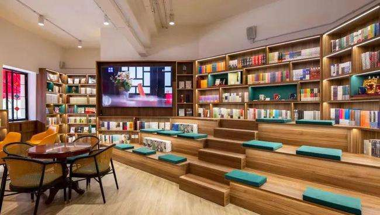

# 1925书局

位于虹口区四川北路856号的 **“1925书局”**，前身是成立于1925年的商务印书馆虹口分店。作为上海唯一持续开业近百年的书店，这里看似低调而平凡，却有着不平凡的历史底色。
自1925年商务印书馆虹口分店在这里开业以来，近百年间，此处一直以书店的面貌与市民亲密接触，成为上海在同一地址运营时间最长的实体书店。

<figure markdown>
  
  <figcaption>（图片来源于网络）</figcaption>
</figure>

#### 营业时间

>:alarm_clock:**时间**：周一至周日 10:00-21:00

#### 地址交通

>:house:**地址**：上海市虹口区四川北路856号
>
>:tram:**地铁**：地铁10号线四川北路4号口/12号线天潼路站

#### 联系方式

>:telephone: **座机**：021-63245234

#### 历史背景

红色，是历史为“1925书局”写下的底色。1925年3月，商务印书馆虹口分店在此建成开业，进行书刊销售，陈云同志曾于1925年至1927年间在此工作3年并加入中国共产党，鲁迅先生常来这里领取稿费和买书，书店一墙之隔就是丁玲故居。

1919年12月，从青浦练塘走出来的陈云进入上海商务印书馆，先后当过学徒、工人，是真正的工人出身。他在商务印书馆虹口书店当店员时，接触书籍很多，平时刻苦读书。正是在这样的条件下，陈云阅读了进步书刊。那个时候，大革命的风暴正席卷全中国，陈云积极参加当年的工人罢工斗争。他很快就成为商务印书馆工人运动的组织人，代表工人向资方提出要求有利有节，使罢工运动屡获胜利。

1925年，发生了震惊中外的“五卅惨案”。年方20的陈云被商务印书馆发行所职工会第一届执行委员会推选担任委员长，领导大家参与到反抗日本资本家的罢工斗争中。

1925年8、9月间，已经参加了共产党领导的革命活动并且经受了考验的陈云，经董亦湘、恽雨棠介绍加入了中国共产党，从这一天起，陈云就把自己的一生交给了共产主义事业。不久，陈云还担任了中共商务印书馆总支部干事兼发行所分支部书记，成为商务印书馆很有影响的工人运动领导人。

1982年，陈云来沪视察工作时，专门为商务印书馆虹口分店题了词。如今，这家上海唯一至今持续开业近百年不断的书店，以“1925书局”的名字再度与读者见面。

升级改造后的1925书局进一步融入以四川北路为中轴的红色文化生态，还原了当年商务印书馆虹口分店的风貌，继承了传承百年的红色基因。走进书局一楼，映入眼帘便是一个抽象设计的火炬艺术造型。“星星之火，可以燎原”，螺旋上升的火炬正寓意着革命火种生生不息，也寓意着红色文化将在这片赤红色的土地上蔓延、传承。

#### 经营现状

整个一楼将上海文化品牌作为设计的主题和思路，划分出了三个区域，分别对应海派文化、红色文化、江南文化的三大文化品牌。书店一楼还开了家土生土长的上海老品牌“上海咖啡”，为读者还原小时候铝锅煮上海咖啡的香甜记忆。

<figure markdown>
  
  <figcaption>（图片来源于网络）</figcaption>
</figure>

沿着楼梯拾级而上，便走回了陈云同志奋斗过的岁月。

<figure markdown>
  
  <figcaption>（图片来源于网络）</figcaption>
</figure>

以陈云同志为主题的展览细述了老一代无产阶级革命家不计个人得失，不在意物质享受，在工作中吸收新思想、新知识，最终追随党的脚步，毅然投身革命的人生经历。

穿过一片石库门，便来到了名为“新华里”的沉浸式红色文化阅读空间。这里还保留了一扇窗，是当年反动军警前来抓捕时，陈云同志撤退的通道。整个空间以“铭党史、砺初心”为主题，囊括了“党史学习”“四史教育”“领袖风采”“领导著作”“国家理治”“不忘初心”“党务工作”“脱贫攻坚”“队伍建设”“时代楷模”“强国时代”“砥砺奋进”“展望十四五”以及“初心之地 光荣之城-上海”板块丰富的党史学习资料，带读者回望党的百年历史与辉煌。

<figure markdown>
  
  <figcaption>（图片来源于网络）</figcaption>
</figure>

除了红色文化空间，上海新华传媒连锁有限公司联合上海联通共同打造的1925书局全店覆盖5G网络，引入了全息展示、AR 互动、沉浸式互动话剧体验等更多样的科技、艺术形式，既利用了联通创新科技能力赋能红色党建，还要让红色文化走入当代生活，吸引更多年轻读者走进这家红色书店。书局的二楼外部大厅区域，还开辟出第三类阅读空间，为读者打造出宽松、便利的阅读环境，让人们能在这里安静惬意地享受阅读、品味咖啡，沉浸在上海文化的氛围之中。

<figure markdown>
  
  <figcaption>（图片来源于网络）</figcaption>
</figure>

#### 趣闻轶事

!!! abstract ""

    经过升级改造，位于四川北路856号的1925书局近日正式开业。7月3日下午，一场“七一”特别版“追寻·前行”红色剧本杀在书店开启，活动吸引30余名青年读者参与，体验了多个红色主题的剧本杀。

    当天下午，30余位玩家体验了《追寻》《觉醒时代》《黎明计划》这三款红色主题剧本杀。其中，《追寻》是以革命先辈李大钊的故事为内核的剧本，讲述一封举报信牵动一场时隔多年的重大案件，四位青年警察在前辈的指引下，一步步逼近案件真相的故事。《觉醒时代》让玩家通过纸牌游戏为动荡时代寻找出一条通往光明的道路。《黎明计划》讲述了六位老友在建党100周年的时候重聚，一起回溯和揭开一件尘封多年的往事，该剧本预计于7月中旬正式上线，青年读者先“玩”为快。玩家们的热情持续了近四个小时，游戏结束时还意犹未尽地听引导员们复盘。

    未来，1925书局将提供更多沉浸式、定制化剧本，让更多人以有趣又有意义的形式学习党史，让更多年轻人走进1925书局，发现书店的魅力。

    <figure markdown>
    
    <figcaption>（图片来源于网络）</figcaption>
    </figure>

??? info "参考文章链接"

    *1.[百年“1925书局”升级开业，陈云在这里加入中国共产党](https://baijiahao.baidu.com/s?id=1703703832896571859&wfr=spider&for=pc)*
    
    *2.[百度百科](https://baijiahao.baidu.com/s?id=1720161378702025714&wfr=spider&for=pc)*
    
    *3.[在陈云入党的红色书店，玩一场《觉醒时代》剧本杀](https://export.shobserver.com/baijiahao/html/382780.html)*