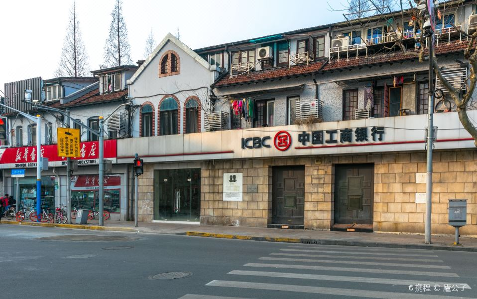
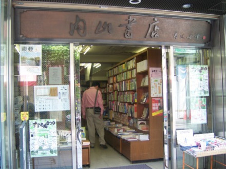
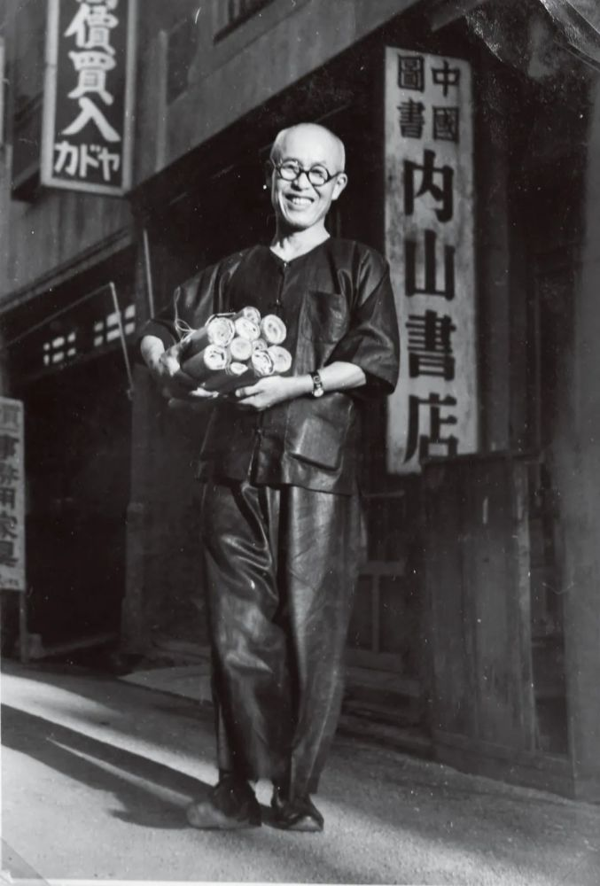

# 内山书店旧址

**内山书店**是鲁迅晚年在上海的重要活动场所，由日本友人内山完造开设。鲁迅常来内山书店购书、会客，并一度在此避难。书店成为中日文化交流的桥梁。1998年9月25日，中国工商银行虹口支行、虹口区文化局、鲁迅纪念馆在此隆重举“内山书店纪念式揭幕仪式”。

<figure markdown>
  
  <figcaption>（图片来源于网络）</figcaption>
</figure>

#### 营业时间

>:alarm_clock:**时间**：周一至周日 9:00-20:00

#### 地址交通

>:house:**地址**：上海市虹口区四川北路2050号
>
>:tram:**地铁**：地铁3号线东宝兴路1号口

#### 联系方式

>:telephone: **座机**：021-56712367

#### 历史背景

内山完造先生在辞去大学眼药经理人职务、专营内山书店前,夫人内山美喜已经在他们魏盛里住家楼下的半间客堂开设了书摊。

当时只有王宝良一个学徒做帮手,卖些圣经之类的东西。那时候,内山先生走南闯北,买卖药品,夫人闲着无事,摆个书摊,一则消遣光阴,二则赚点外快补贴家用。但是,正是温顺文静的夫人“无心插柳柳成荫”,书摊销路畅通,意外地获得成功,改变了内山先生一生的道路。

1923年内山先生专营书店后,在魏盛里又租下两间门面的店堂,扩充业务,在弄堂口正式挂出“内山书店”店牌。这时书店经营以日文书籍为主,自然科学和社会科学的书籍都有,甚至连被当局查禁的进步书籍包括列宁全集在内均有出售。以后,内山书店迁到北四川路千爱里。

<figure markdown>
  
  <figcaption>（图片来源于网络）</figcaption>
</figure>

#### 经营现状

为了纪念和追寻鲁迅先生的足迹，9月25日，“1927·鲁迅与内山纪念书局”项目在内山书店旧址启动，“木刻讲习所旧址”陈列馆开放，串联起鲁迅在虹口活动场所的“鲁迅小道”升级亮相。

该项目将由内山书店旧址和新华书店山阴路店整体贯通而成，总面积为800平方米左右，是一个以书为本的小型文化综合体。尤其以鲁迅的创作脉络和社会文化活动为核心，全方位陈列展示鲁迅相关作品，用书籍为读者还原一个全面真实的鲁迅。

同时，重点引进和推荐日本出版物中关于中国文化、上海题材的优秀原版书籍，将鲁迅与内山的友谊通过当代出版物的交流继续发扬。

#### 趣闻轶事

!!! abstract ""

    鲁迅第一次到内山书店是在1927年10月3日。
    
    据《鲁迅日记》记述，这天鲁迅是与许广平一同去的，共买书四种四本，花费十元二角。自此以后，鲁迅常常光顾内山书店，并购买了大量书刊。又据《鲁迅日记》披露，从1928年到1935年，鲁迅累计去过内山书店五百多次，买书一千多册。
    
    内山书店对于鲁迅而言，兼具“书店”和“沙龙”两种文化空间的特色。内山书店的意义不仅在于它给鲁迅提供了各种书籍、期刊等新型文字媒介，还在于它本身也起到了媒介作用，鲁迅通过这个空间逐渐建立起自己的共同体，并与外界进行交流，成就了其犀利的思想。

    <figure markdown>
    
    <figcaption>（图片来源于网络）</figcaption>
    </figure>

    内山书店还发行当时被禁售的鲁迅著作《伪自由书》《南腔北调集》《准风月谈》等，并代售鲁迅自费出版的《铁流》等6种文学读物。
    
    在内山书店中，书籍都敞开陈列，读者可以随手翻阅，店堂里摆着长椅和桌子，读者可以坐在那里看书。内山书店不管金额大小，对中国读者实行赊卖方式。
    
    为方便读者购书，书店编印有“新书介绍”供应读者。为此，受到读者欢迎，营业颇盛。在白色恐怖严重时及一二八淞沪抗战时，鲁迅和郭沫若都曾到该店避难。
    
    抗日战争结束，书店于由国民政府接收而停业。上海人民为了纪念内山完造和他从事书店的业绩，于1981年9月在内山书店原址立石纪念：“此店为日本友好人士内山完造所设。鲁迅先生常来店买书、会客，并一度在此躲避国民党追捕，特勒石留念”。

!!! abstract ""

    某个阴雨天，内山老板看到一个穿着黄卡其布工人制服的小伙子用手摩挲鲁迅翻译的《毁灭》，不说买，也舍不得放下。看出缘由的鲁迅走过来取下一本《铁流》，对青年说，“两本，一块钱，我卖给你。”刚才还窘迫万分的小伙子掏出银元，红着眼睛把钱放到先生手里，恭敬地深鞠一躬。

    几个月后，带着侄女逛书店的郁达夫对先生说，“我这侄女是学画的，你有什幺画册给她一点吧。”鲁迅笑着答应了，不久便送了一本精装的俄国版画集《引玉集》，首印只有五十本，还亲笔写下了编号“37”。

    转过年来的初冬，从哈尔滨辗转青岛来到上海的萧军、萧红夫妇在店外看到了先生的背影。推门而进，鲁迅一眼就认出了他俩。在街对面的咖啡馆，两人讲述了曲折的写作经历，先生鼓励他们认识上海，写出更好的作品，还在酒宴上把二萧引荐给茅盾、聂绀弩等左翼作家，后来更是为萧红的《生死场》写了序。

    <figure markdown>
    
    <figcaption>（图片来源于网络）</figcaption>
    </figure>

??? info "参考文章链接"

    *1.[鲁迅诞辰140周年，内山书店旧址将打造为纪念书局](https://www.sohu.com/a/491990479_260616)*
    
    *2.[百度百科](https://baike.baidu.com/item/%E5%86%85%E5%B1%B1%E4%B9%A6%E5%BA%97/588647)*
    
    *3.[内山书店：文豪们的“书房”和“会客室”](https://www.fx361.cc/page/2021/0908/9282790.shtml、)*