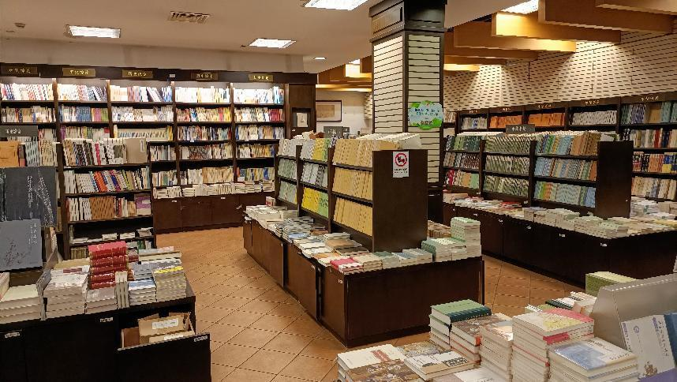

# 上海古籍书店

**上海古籍书店**是上海成立最早的专业书店，也是具有55年历史的老字号专业书店。三楼是特价书店。四楼为博古斋。

#### 营业时间

>:alarm_clock:**时间**：周一到周日09:30-18:00

#### 地址交通

>:house:**地址**：上海市黄浦区福州路401号
>
>:tram:**地铁**：人民广场站15出口出站步行
>
>:bus:**公交**：九江路浙江中路站

#### 联系方式

>:iphone:**座机**：02163282891

#### 历史背景

上海古籍书店是上海成立最早的专业书店，原为正言出版社。1950年关闭后，又成为了新华书店的古籍门市部。1956年5月，9家私营古书店并入该门市，成为当今的古籍书店。

改革开放期间，上海古籍书店不断拓展与探索，“化一为五”来改变一家书店力量微弱的局面。

1988年6月16日成立上海书店。

1993年8月15日，上海古籍书店文物部独立成为上海博古斋。

2004年6月25日，上海古籍书店艺术部扩展成为独立艺术书坊。

2006年年末，上图公司又申请正式成立上海博古斋拍卖有限公司。

1989年新文化服务社成立。

2000年服务社从长乐路搬迁到瑞金二路，相继设立旧书精品室、九华堂书斋和淘友俱乐部，成为国内最大旧书店和旧书爱好者的乐园。

2004年上海古籍书店终于回到了福州路。

#### 经营现状

书店一、二楼是古籍书店，店内主要出售古书古籍，从历史典籍，诗词歌赋，到国学中医，品类齐全。入门和专业书籍一应俱全，店内允许直接翻阅书籍和抄写书内内容。店内也专门设有用于阅读的区域。

三楼是全国最好的特价书店，品种杂而多，价格比网上售卖的还要便宜许多，时不时可以在这里以极低价淘到想要的书。

四楼博古斋以经营旧版线装古籍书、民国杂志、新文学读物、拓片、碑帖，珂罗版画册为主。

#### 趣闻轶事

!!! abstract ""
    1972年宜稼生同志去嘉定流动收购时，发现一位农民从一处古墓中掘得一包古书。当时这些书已被墓中尸体体液浸透结成硬块，后来由上海博物馆的同志采用化解方法一页一页揭开，原来是17种明代成化年间刻印的民间说唱本。
    
    这件事还惊动了中央文物局领导，认为是又一个马王堆，也有的专家说把中国之有民间说唱词话提前了三百年，可见其价值是很大的。有趣的是据说那古墓主人姓宣，发现古书的农民也姓宜，我们的收购员也正好是宣稼生同志，真是有缘。

!!! abstract ""

    1973年我们恢复了古籍书店，但在许多人中间仍是有争议的：古籍书店究竟要不要恢复？在这时，仓库里的同志在整理古旧书时发现了半部清代乾隆年间钞本《戚慕生序石头记》（共10册，即红楼梦的前40回）。
    
    经考证，这正是有正书局《国初钞本原本红楼梦》所用的底本。这发现受到叮有关各面的几，是关于要不要恢复古籍书店的争论也就停止了。人们都说：是半部《红楼梦》救活了古籍书店。

??? info "参考文章链接"

    *1.[百度百科](https://baike.baidu.com/item/古籍书店)*
    
    *2.[上海“老字号”书店的古往今来](https://www.sohu.com/a/253754235_657094)*