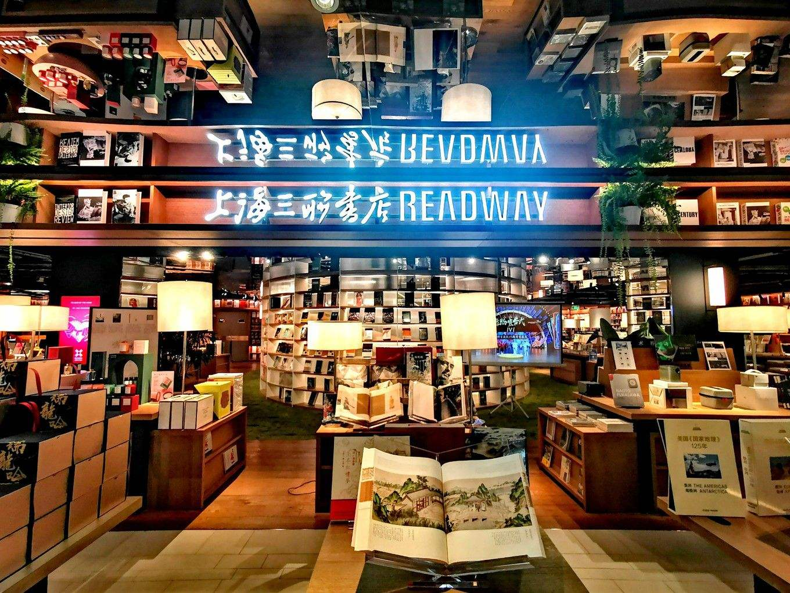
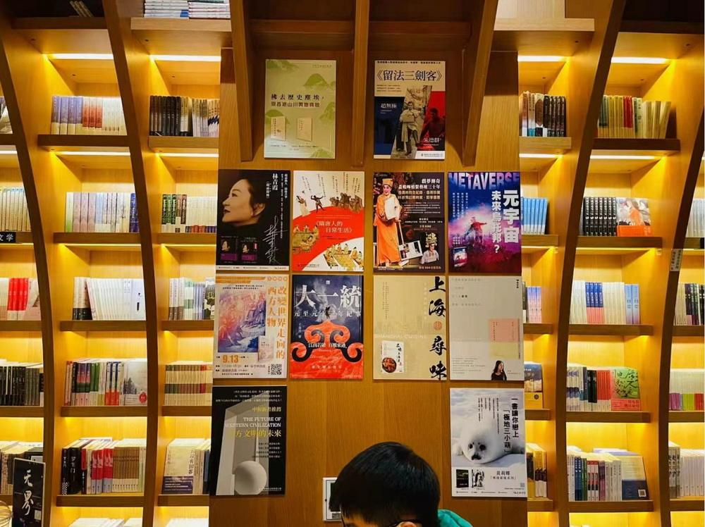

# 上海香港三联书店

**上海香港三联书店**（简称三联书店） 是一家有悠久历史的著名出版社，由上海图书公司、上海三联书店出版社和三联书店（香港）有限公司联合投资组建，该公司主要经营三联书店版、上海书店版图书及其他国内外出版物。

#### 营业时间

>:alarm_clock:**时间**：周一到周日10:00-18:00（目前暂定）

#### 地址交通

>:house:**地址**：上海市淮海中路624号
>
>:tram:**地铁**：13号线淮海中路地铁站/1号线黄陂南路站
>
>:bus:**公交**：淮海中路思南路

#### 联系方式

>:fontawesome-brands-weixin:{ .weixin }  **微信**：上海香港三联书店有限公司
>
>:fontawesome-brands-weibo:{.weibo} **微博**：上海香港三联书店
>
>:fontawesome-brands-tiktok:{.tiktok} **抖音**：shjpc_1990
>
>:telephone: **座机**：021-53064393

#### 历史背景

三联书店的前身是上世纪三四十年代活跃于中国出版界的三家著名出版发行机构——生活书店、读书出版社、新知书店。

生活书店成立于1932年7月，创办人是邹韬奋、胡愈之、徐伯昕等，前身是创办于1925年的《生活周刊》。读书出版社成立于1936年，创办人是李公朴、艾思奇、黄洛峰等，前身是1934年创刊的《读书生活》半月刊，1937年更名为读书生活出版社。新知书店成立于1935年，创办人是钱俊瑞、徐雪寒、华应申等，前身是《中国农村》月刊。

从1928年6月《生活》周刊社开始出版图书，至1948年10月三店正式合并为止，三店共出版图书2000余种，先后共编辑出版期刊约50种。三店先后在上海、汉口、广州、西安、香港等地开办过百余家分店。

1951年8月，三联书店并入人民出版社，仍保留“三联”名义出书，按需要出版“非马列”或“力图运用马列但还不纯熟”的著作。1954年4月，三联获中央批准有了自己的编辑室，下辖中国历史、外国历史、地理等六个编辑组。

1979年，《读书》杂志创办起。

1986年1月1日，三联书店恢复独立建制。

1986年12月，上海市委宣传部批复同意上海图书公司、上海三联书店出版社和三联书店（香港）有限公司合资经营沪港三联书店读者服务中心。

1990年4月，上海香港三联书店有限公司正式注册成立，成为国内第一家沪港合资经营的书店。经国家新闻出版总署指定，获得《出版物进口经营许可证》，可以从事出版物进出口的专业图书公司，以此加强大陆与香港地区的图书交流，架起中外文化交流的桥梁。

#### 经营现状

上海香港三联书店，位于上海文化中心城区淮海中路624号，营业面积180平米，陈列书籍五千种，文创产品千余种。

书店内的阅读空间被分为两个区域。右手边是文创产品区，RUBINATO、KAWECO、MOLESKINE等欧洲老牌文具、中国传统的红木书签等主题联名产品，玲琅满目的彩品在怀旧吊灯的照映下熠熠生辉。艺术收藏区的紫砂茶壶和瓷器精品应接不暇，名家书法作品更是给人一种艺术的享受，引领读者走进艺术畅想。

左侧区域根据三十年来周边读者群的需求，着重展示“北京三联”、“上海三联”、“香港三联”版图书以及港台版图书、社科文学和艺术类画册。靠窗处有沙发可供休息，以便读者们坐拥自己喜爱的图书，享受这一刻属于自己的小确幸。

#### 趣闻轶事

!!! abstract "店徽"
    

    三联店徽的原型来自生活书店店徽：1936年，美工郑川谷据苏联宣传海报（《打击懒惰工人》1931年 佚名 ）移植过来，设计了店徽。 图案外围作齿轮形，中间是立足点一致的三个挥动锄镐的筑路工人，沿着三柄锄镐横穿有一条弧形光芒。40年代后期，还有一幅与店徽相仿的方形图案，作为出版标记印在部份出版物上。

!!! abstract "多个第一"

    上海香港三联书店开业之初，书店以经销港版图书和首推的服务四项第一而被读者津津乐道，名噪一时。这是第一家开架售书的书店，是第一家站立服务的书店，是第一家使用条形码售书的书店，也是第一家开设夜市的书店。

??? info "参考文章链接"

    *1.[生活·读书·新知三联书店_百度百科 (baidu.com)](https://baike.baidu.com/item/生活·读书·新知三联书店/6871441?fromtitle=三联书店&fromid=1133079&fr=aladdin)*
    
    *2.[上海香港三联书店有限公司_百度百科 (baidu.com)](https://baike.baidu.com/item/上海香港三联书店有限公司/10248652?fr=aladdin)*
    
    *3.上海香港三联书店微信公众号*