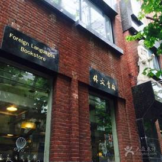
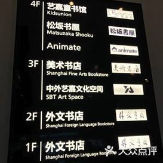
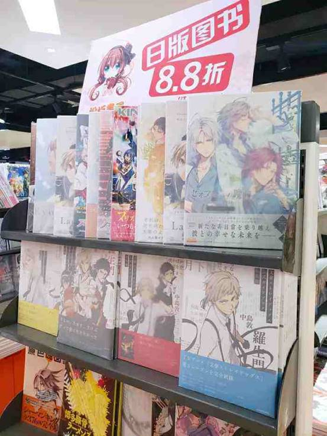
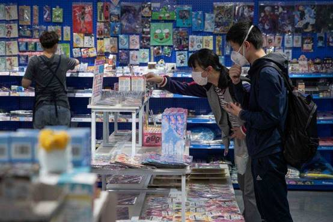

# 上海外文书店（福州路总店）

## 一、历史背景

上海外文书店的历史，可以追溯到1843年。上海开埠后，传统中国的绝大部分西学，都是从这里传入中国腹地，上海是名副其实的西学传播中心。文化是历史的重要部分，而它的主要载体是书籍。西方文化在中国传播的途径，包括书籍译述、报刊发行、办学育才等方法，其中最集中、最为中国大众所接受的，便是西书译述。因而，从19世纪晚期开始，上海便集中了为数众多的西文书店。上海外文书店便是其中一所。

1950年，上海外文书店前身国际书店上海分店成立。 1958年，上海外文书店正式成立。 1985年，在上海外文书店的基础上成立上海外文图书公司，是全国第一家经国家批准的地方性图书进口公司。 1992年，上海对外出版贸易总公司上海分公司并入上海外文图书公司。 2013年，上海外文图书公司加入上海世纪出版集团。 2015年，因企业公司化改制，上海外文图书公司更名为上海外文图书有限公司。

## 二、经营现状

上海外文书店，共4层，主要以出售外文原版图书为主，对此类图书有需求的小伙伴这里绝对是不二之选了。

 

一楼基本都是英文原著和杂志，亮眼的还得是那个常常联动的咖啡店，不过因为疫情原因现在是没有活动的。同时在一楼还有个专门卖文具的区域，有需要的可以留意一下。

 

二楼是小语种专区，有各种考试的书籍、教材和原版书等等，让人不禁回忆起初高中被英语支配的恐惧。

 

三楼是美术书店，售有各类艺术书籍，包括各类画册、艺术史、艺术品。让人印象比较深刻的是这层有着大量的美术设定集，有关于各个游戏，电影，动漫等等，喜欢的人请不要错过。

 

四楼分三个部分。首先是童书馆，有各种少儿绘本和各种考试书籍。其次在中间的一块是松阪书屋，也就是日文部，里面有大量的日文原版漫画、杂志和书籍。最后一个重量级，Animate上海店。相信不少00后都是冲着这个取得外文书店，懂得都懂，这里我就不多赘述了。

## 三、相关

1958年，上海外文书店Shanghai Foreign Languages Bookstore成立，坐落于福州路上。今天的福州路有些旧了，甚至有些破败。杏花楼里，推杯换盏的，早已不再是鲁迅和王韬，但透过暮春时节茂盛的梧桐枝桠，依然可见大大小小的书店招牌。它被誉为“中华文化第一街”，散布着上海书城、古籍书店、外文书店、科技书店等大型书店以及多家笔墨纸砚馆。

 

对于年轻一些的朋友们，那说到上海外文书店就不得不提到其中的日文部——松阪书屋了。松坂书屋是上海外文图书有限公司旗下专营日文原版图书的书店。这里品种繁多，主要经营的书籍种类有：文学、娱乐、时尚、生活、语言、旅游等等。

当然还有一个重点，那就是同样位于4F的Animate上海店，也就是大家常说的A店。在这里各种日本轻小说、漫画、模型和手办琳琅满目，不过相对的这里的价格就比较高了，一般来说是网上的两倍左右

## 四、网站链接

无

## 五、营业时间

周一到周日10:00-18:30

## 六、联系方式

上海外文书店：021-23204888

松坂书屋：021-23204981

Animate：021-23204981

## 七、交通

上海市黄浦区福州路390号

地铁；人民广场站15出口出站步行

公交：九江路浙江中路站

 

 
