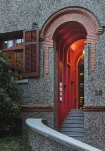
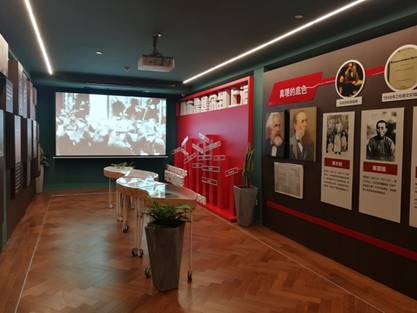
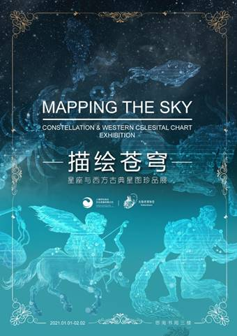
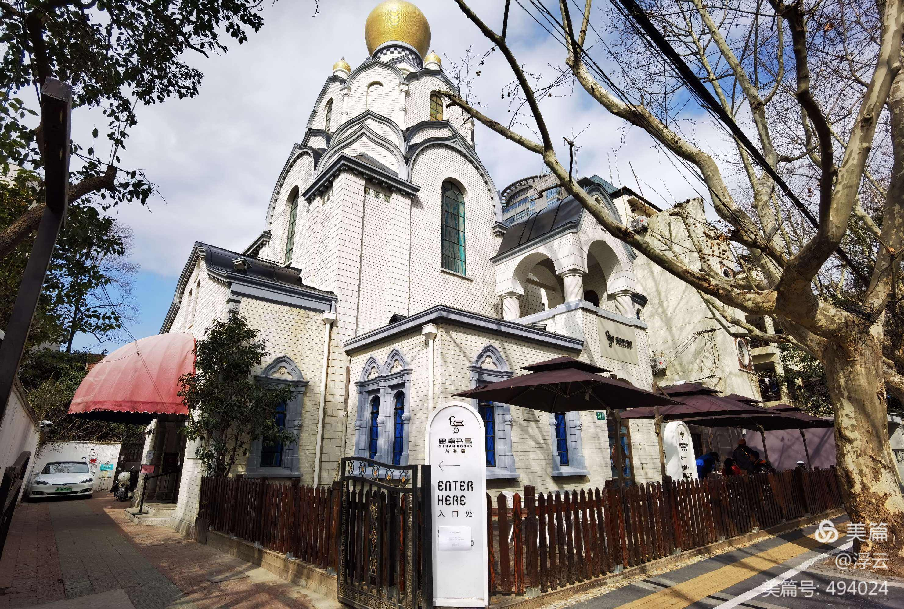

# 思南书局（黄浦区）

**思南书局**，位于上海思南公馆区域的沿街建筑，这栋建筑曾经是冯玉祥的故居，现在改成了书局，三层楼的小洋房到处都可体现设计师的用心，绝对结合了新世纪网红的全部概念，又不失以书为本的主题，文化网红无疑了。

#### 营业时间

>:alarm_clock:**时间**：周二至周日10：30-18：00

#### 地址交通

>:house:**地址**：上海市黄浦区复兴中路517号
>
>:tram:**地铁**：地铁13号线一大会址•新天地站5号口/1、10号线陕西南路站
>
>:bus:**公交**：重庆南路复兴中路站（36、780、786、869、933、986）

#### 联系方式

>:iphone:**电话**：13917497850

#### 历史背景

思南公馆街区始建于1920年，于2010年完成保留保护改造，是目前上海市中心唯一一个以成片花园洋房形式保留保护为特色的项目。以复兴中路以南，思南路两侧，以及重庆南路以西为界，51幢历史保留保护建筑，荟萃了上海10种近代历史建筑类型中的8种。

周恩来、曾朴、梅兰芳、柳亚子等都曾在此留下生活印记。思南公馆的投资运营方上海永业集团，秉承“重现风貌，重塑功能”的原则，历经10年艰苦保护，以精雕细琢的匠心将历史建筑原地修缮、原貌重现，并将商业、办公、酒店、住宅等现代化功能有机融合其中。

按照“文化思南、城市空间”和“公共互动，开放包容”的运营理念，着力打打造上海充满人文精神的城市公共空间，不新探索更活跃、更国际、更上海的思南模式，推出了一批思南品牌活动如：思南读书会、思南纪实空间、思南赏艺会、思南城市空间艺术节、思南街角之声等，持续用创意点亮公共空间，用人文传递城市温度。

思南书局是思南公馆25号楼改建而成的一家新书店。它是上海不可移动的文物建筑，曾是冯玉祥将军旧居，大诗人柳亚子也曾两度寄居于此编书。该书店由上海市新闻出版局、上海市作家协会、中共上海市黄浦区委宣传部、上海世纪出版集团和上海永业集团等几方多年共同打造并不断融合提升。

《思想史：从火到弗洛伊德》的作者彼得·沃森称赞它为“上海最精致的书店”。历史学家大卫·阿米蒂奇在来访思南书局时说道：“我最喜欢的书店有两个：一个是伦敦书评书店，另一个就是这里。”

#### 经营现状

2018年4月23日，在第23个世界读书日、“思南读书会”开办四周年之际，思南书局实体店将于复兴中路517号正式揭牌。

思南书局设计师曾在发文中写道：“人，无论贵贱，有着心灵、思想，会学习，也有潜意识。最后我决定把思南书局看成一个人，是一个有历史同时面对未来的上海人。”

书局共分四层，一楼是思南书局的潜意识，是思南书局的历史哲学专区，图书陈列阅读区选配了近2500种历史、哲学类图书，并设有读者专属书房。

入口层是二楼，符合25号楼最初的使用情况，心灵蕴含有人的气质（而非性格），以及欲望与本能，它兼具公共性和私密性。这层设置了思南客厅、文学区和咖啡馆，文学区中有许多推荐书单和书籍，包括思南书局推荐榜单、伦敦书评书店新书榜单，精选近2000种中外文学图书及相关品牌杂志。

三楼是思南书局的眼睛和耳朵，这里是展厅和艺术书籍区域以及一个隐秘的思南乐房，有展览，有读书会，还有音乐会，感受艺术如海浪席卷人的魅力。

四楼是大脑，是思想，就是作家书房，会举办小型的文化沙龙，是思辨的场所。

思南书局自开业以来还举办了各种阅读及图书展览活动。

2018年适逢《共产党宣言》问世170周年，在思南书局正式营业之际，首场主题活动“从布鲁塞尔到上海——《共产党宣言》170周年主题展”同时揭幕，多语种、历史版本和最新版本的《共产党宣言》在此次展出。

同年4月举办的活动还有思南下午茶：俞菱和她的朋友们、思南经典诵读会：莎士比亚作品专场、思南读书会嘉宾签售会等。

开业期间也恰逢罗大佑5.11“当年离家的年轻人”上海演唱会，书局一楼的二人书房特别布置成罗大佑音乐主题空间，现场展示罗大佑珍贵磁带、《恋曲1980》歌词创作时候的手稿，并播放那些耳熟能详的经典歌曲，让读者一起追忆光阴的故事。

2021年新年伊始，思南书局举办古典星图珍品展，带领读者一起用14厘米折射望远镜观月，在书店仰望星空，此次展览的主体是7本来自欧洲的华丽星空图集，这也是它们在国内的首次集中展览，其中包括1535年版的《天文的诗歌》、1742年的《多贝玛亚星图》等等。

思南书局被称之为梧桐树下人文心脏，它在满足广大市民对文化产品的需求和热爱，展示文化出版人的使命和担当以及打响上海的文化品牌三个层面上具有重要意义。

“思南”系文化空间的蓬勃发展，使得思南公馆不只是一个商业地标，更是一个文化地标，老洋房里的文化与书香助力提升了上海这所城市的文化格局和生态。

如今思南书局正朝着品质化、国际化、生活化的方向稳步迈进，继续传承与延续思南精神，将精品生产和阅读推广进行到底。

#### 趣闻轶事

!!! abstract "从冯玉祥到柳亚子"
    
    产权人曾为爱国将领冯玉祥（1882—1948），其妻李德全于1951年将其捐献给国家。
    
    诗人柳亚子（1887—1958），于1936年—1940年和1946年—1947年在此租住。
    
    
    
    2011年之前，这幢花园住宅墙面上的铭牌只写着“柳亚子旧居”，似与冯玉祥将军无关。
    
    其实，这幢住宅是冯玉祥将军购置的。不过，是在冯的副官刘广化和冯夫人李德全亲属丰云鹤名下。为什么产权未列在冯玉祥名下？据说，这也是当时的名人常有的举措。因为，冯在淮海路等地另有居所，而且人也不常在上海。20世纪三四十年代，挂名产权人改为黄氏。
    
    新中国成立以后，黄氏将地产契约归还李德全。1951年时任卫生部部长李德全为支援抗美援朝，将该住宅所有契纸托人送交上海市人民政府陈毅市长收存，1952年2月7日立据“赠与”政府。
    
    于是，这幢花园住宅改为民居租赁房和卢湾区人民政府招待所用房。2000年在迁走居民后被改建成思南公馆的一个独立空间，其后有商家租用，而今开设思南书局实体店。

??? info "参考文章链接"

    *1.[新开的思南书局，为何是不可复制的？文化课澎湃新闻-The Paper](https://www.thepaper.cn/newsDetail_forward_2090498)*

	*2.[上海思南书局 | 梧桐树下的人文心脏_新书店 (sohu.com)](https://www.sohu.com/a/257487265_696292)*

	*3.[思南书局举办古典星图珍品展，在书店仰望星空|宇宙新浪财经新浪网 (sina.com.cn)](https://finance.sina.com.cn/jjxw/2021-01-20/doc-ikftpnnx9592157.shtml)*

	*4.[思南书局：有颜值，有好书，有展览，还有各种阅读活动文化课澎湃新闻-The Paper](https://www.thepaper.cn/newsDetail_forward_2092254)*

