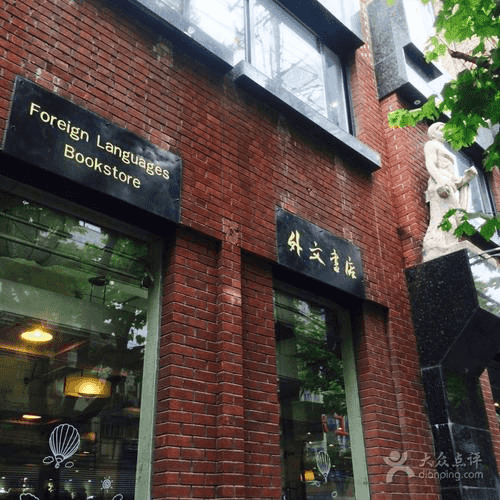
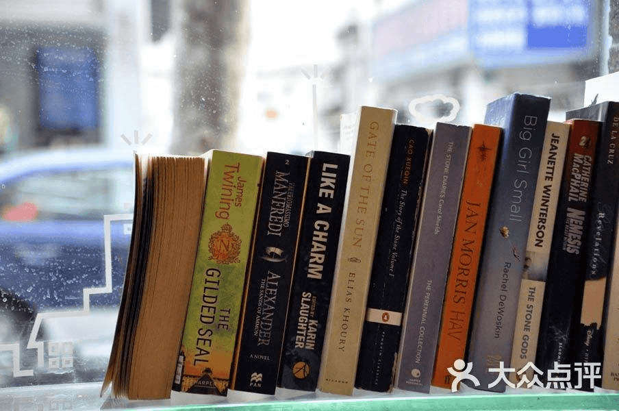
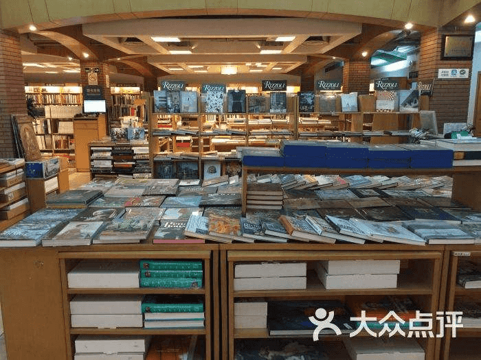
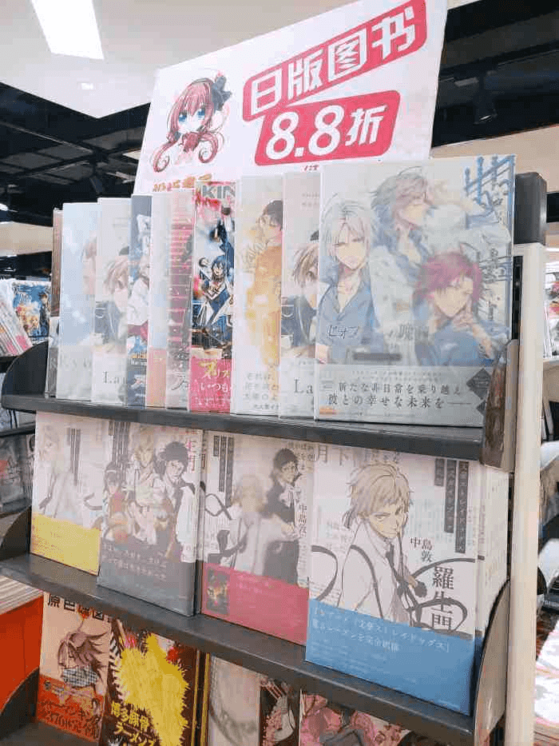

# 上海外文书店（福州路总店）

在福州路上，有一座亮眼的红房子，它就是名闻海内外的 **“外文书店”**。上海外文书店的前身是仅次于商务、中华书局的“世界书局”，当时因其门面被漆成红色，故又有“红屋”之称。这栋大楼是原世界书局大楼，2015年收进上海优秀历史建筑名录。大楼为钢筋混凝土结构，建筑立面为深红色陶面砖和浅色水泥粉刷相间，强调竖线条构图。1950年，在解放前四大书局之一的世界书局旧址上成立了国际书店上海分店，1958年更名为上海外文书店。到今年，上海外文书店已经成立了70余年。

<figure markdown>
  
  <figcaption></figcaption>
</figure>

#### 营业时间

>:alarm_clock:**时间**：周一到周日10:00-18:30

#### 地址交通

>:house:**地址**：上海市黄浦区福州路390号
>
>:tram:**地铁**：人民广场站15出口出站步行
>
>:bus:**公交**：九江路浙江中路站（20路、37路、49路、167路、330路、805路）

#### 联系方式

>:fontawesome-brands-weibo:{.weibo}**微博**：上海外文书店
>
>:telephone:**座机**：021-23204888/021-23204981（松坂书屋&Animate）

#### 历史背景

上海开埠后，传统中国的绝大部分西学，都是从这里传入中国腹地，上海是名副其实的西学传播中心。文化是历史的重要部分，而它的主要载体是书籍。西方文化在中国传播的途径，包括书籍译述、报刊发行、办学育才等方法，其中最集中、最为中国大众所接受的，便是西书译述。因而，从19世纪晚期开始，上海便集中了为数众多的西文书店。上海外文书店便是其中一所。

1950年，上海外文书店前身国际书店上海分店成立。 

1958年，上海外文书店正式成立。 

1985年，在上海外文书店的基础上成立上海外文图书公司，是全国第一家经国家批准的地方性图书进口公司。 

1992年，上海对外出版贸易总公司上海分公司并入上海外文图书公司。 

2013年，上海外文图书公司加入上海世纪出版集团。 

2015年，因企业公司化改制，上海外文图书公司更名为上海外文图书有限公司。

#### 经营现状

上海外文书店，共4层，主要以出售外文原版图书为主，对此类图书有需求的小伙伴这里绝对是不二之选了。

一楼基本都是英文原著和杂志，亮眼的还得是那个常常联动的咖啡店，不过因为疫情原因现在是没有活动的。同时在一楼还有个专门卖文具的区域，有需要的可以留意一下。

二楼是小语种专区，有各种考试的书籍、教材和原版书等等，让人不禁回忆起初高中被英语支配的恐惧。

三楼是美术书店，售有各类艺术书籍，包括各类画册、艺术史、艺术品。让人印象比较深刻的是这层有着大量的美术设定集，有关于各个游戏，电影，动漫等等，喜欢的人请不要错过。

四楼分三个部分。首先是童书馆，有各种少儿绘本和各种考试书籍。其次在中间的一块是松阪书屋，也就是日文部，里面有大量的日文原版漫画、杂志和书籍。最后一个重量级，Animate上海店。相信不少00后都是冲着这个取得外文书店，懂得都懂，这里我就不多赘述了。

#### 趣闻轶事

!!! abstract "松坂书屋"
    

    对于年轻一些的朋友们，那说到上海外文书店就不得不提到其中的日文部——松阪书屋了。松坂书屋是上海外文图书有限公司旗下专营日文原版图书的书店。这里品种繁多，主要经营的书籍种类有：文学、娱乐、时尚、生活、语言、旅游等等。

!!! abstract "Animate上海店"
    

    同样位于4F的Animate上海店，也就是大家常说的A店。在这里各种日本轻小说、漫画、模型和手办琳琅满目，不过相对的这里的价格就比较高了，一般来说是网上的两倍左右。大家在这里购物时，得多留意一下自己的钱包哦。

??? info "参考文章链接"

	*1.[“四马路”上的上海外文书店 开了70年的宝藏书店|上海外文书店|书店|福州路|世界书局 (qq.com)](https://xw.qq.com/cmsid/20201112A0396500)*

	*2.[@上海外文书店 的个人主页 - 微博 (weibo.com)](https://weibo.com/n/上海外文书店)*

	*3.[@上海外文书店日文部-松坂书屋 的个人主页 - 微博 (weibo.com)](https://weibo.com/n/上海外文书店日文部-松坂书屋)*