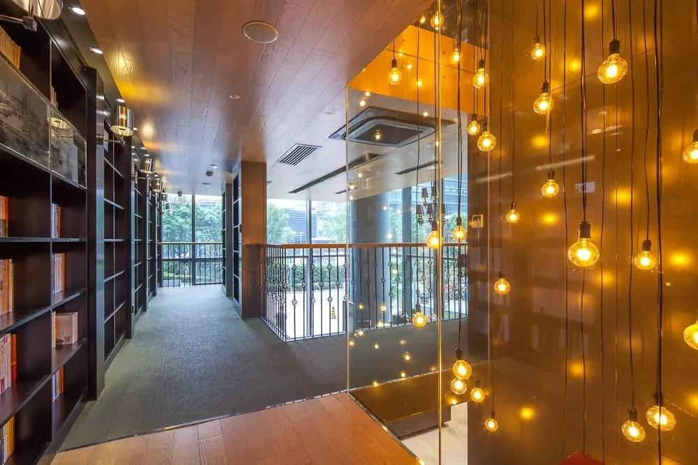

# 建投书局

**建投书局**是建投书店投资有限公司旗下文化空间和图书出版的品牌。建投书局以传记为主题特色,融合了图书、阅览空间、文化活动、文创产品、轻餐饮等多元产品,打造中国领先的文化消费品牌，致力于为读者打造有态度、有深度、有温度的阅读空间，从“内容+功能+体验”三个维度深挖客户价值。

#### 营业时间

>:alarm_clock:**时间**：周一到周日 10:00-18:30

#### 地址交通

>:house:**地址**：上海市虹口区公平路18号嘉昱大厦p18栋1层
>
>:tram:**地铁**：轨道交通12号线提篮桥站/轨道交通4号线内圈杨树浦路站
>
>:bus:**公交**：公交510路东大名路海门路站/公交13路提篮桥站

#### 联系方式

>:fontawesome-brands-weixin:{ .weixin }  **微信**：建投书局/建投书局客
>
>:fontawesome-brands-weibo:{.weibo} **微博**：建投书局
>
>:fontawesome-brands-tiktok:{.tiktok} **抖音**：JICBOOKS
>
>:telephone: **座机**：021-65128619

#### 历史背景

中国建银投资有限责任公司（简称“中国建投”）是一家综合性投资集团，成立于2004年。中国建投以推动技术进步、促进产业升级、建设文化强国、服务消费升级、助力民生改善为使命，致力于为股东创造长期稳定可持续的资本回报，履行国有企业的社会责任。

中国建投凭借健全的投资体系、先进的投资模式，深刻把握中国经济成长转型中的发展动力， 积极拓展全球化布局，重点关注金融服务、工业制造、文化消费、信息技术等行业领域。

中国建投旗下拥有建投投资/建投华文、建投华科、建投控股、建投信托、国泰基金、建投 租赁、投资咨询、建投香港等一级成员企业，以及资产管理分公司、上海分公司2家直管分支机构。

中国建投集团旗下专注于文化出版产业链投资与运营的企业，融合图书/阅览空间/文创产品/轻餐饮等多元产品的复合型城市文化空间。

建投书店投资有限公司是中国建银投资有限责任公司旗下专注于文化产业运营的平台。公司秉承推动财智增长和社会进步的品牌理念，以文化空间运营为基础，以全球化视野为导向，专注于挖掘文化产业优秀创新能力，开发多元文化产品，推动产业资源整合与价值重构，构建文化传媒产业体系，打造具有社会影响力的文化品牌--建投书局。

建投书局是一家以传记为主题特色的书店，秉承“不止于书”的理念，与城市多业态跨界融合，不断拓展运营的边界，专注于成为公共文化空间的运营者、文化产品的提供者和文化资源的优秀整合者，推动书店产业运营模式的创新发展。

以下为相关视频资料：[点击](http://vd3.bdstatic.com/mda-kehkw5j2u4qcsqr2/mda-kehkw5j2u4qcsqr2.mp4?playlist=%5B%22hd%22%5D)

#### 经营现状

建投书局旗舰店上海浦江店位于公平路滨江地带，临近黄浦江。店内图书馆区域拥有巨大落地窗，视野极佳。读者可以在窗外美丽的江景和陆家嘴建筑风光的陪伴下惬意阅读。

一、打造中国第一“人物传记”主题书店

建投书局是一家以传记为主题特色的书店，目前已在北京、上海开设旗舰店，并荣获北京最美书店、上海最美书店等称号，通过别具特色的空间设计、选品陈列与文化活动，打造城 市生活的精神绿洲。

秉承着“每一个人物都是历史的缩影”的理念，建投书局致力于打造中国最好的“人物传记”主题书店品牌。漫步书局，显眼位置可见多处人物传记陈列展桌，上海浦江店内还设有一间超大的“传记图书馆”，两侧八米高的书墙陈列的全部都是精选的传记图书。

<figure markdown>
  
  <figcaption>（图片来源于网络）</figcaption>
</figure>

:material-spotify:出版业务已经起航，目标是国内最好的传记出版品牌

2016年12月，随着《恩佐•法拉利》重磅面世，建投书局传记出版品牌的第一枪已经正式打响。随后，还将有包括ZARA、宜家、百威等品牌创始人在内的知名商业人物传记在建投书局的打造下陆续出版。

人物传记类图书作为人生故事的浓缩，对人类的发展具有巨大的指导意义。国外的人物传记出版事业已经非常兴盛，而国内传记图书市场还相对冷清，很多读者也都还没有形成阅读人物传记的习惯。建投书局希望能够弥补这一块的市场空缺，致力于打造国内最好的传记出版品牌，帮助更多的国内读者通过人物传记的阅读汲取经验，收获智慧。文化艺术长廊，是书店内不容错过的打卡圣地，更是艺术类展览的最佳举办场所。

从包林艺术展到欧洲古董名琴展，从“云鱼之欢”跨界艺术展到“废墟之问”应天齐作品展，从“丁丁历险记”主题展到“西尔万” 原作展，从“黄河十四走”民间艺术展到“好莱坞黄金时代影人影像”真迹展......这里还是沉浸式戏剧“书 店奇妙夜”的舞台一隅。在文化艺术长廊里，我们为书店的灵魂注入了源头活水，也在培育与传播着艺术美 学生活，塑造“不止于书”的文化潮流。

<figure markdown>
  
  <figcaption>（图片来源于网络）</figcaption>
</figure>

:material-spotify:传记咖啡馆&人物主题月，全方位营造人物传记主题氛围

传记咖啡馆以高端精品咖啡为主打，配合店内传记书籍陈列和 饱含“传记精神”的装饰艺术风格，定期推出传记主题特饮与 “邂逅咖啡沙龙活动”，让味觉成为文字与视觉之外的另一种叙事媒介，带领读者阅读一颗咖啡豆到一杯咖啡的故事。

为了营造更为浓郁的主题氛围，除了日常的传记图书陈列与销售外，建投书局还会在每个月推出一个重点主题人物，从月初到月末，多店联动，围绕这一特定人物举办丰富多彩的文化活动，如影像、书籍、手稿、旧物展览，探讨人物作品与人生经历的文化沙龙等。另外，同步推出的主题人物限量礼品包也会让喜欢该人物的粉丝们惊喜连连。

<figure markdown>
  
  <figcaption>（图片来源于网络）</figcaption>
</figure>

对于阅读的最佳伴侣-咖啡，建投书局也进行了充满想象力的延展。在建投书局•上海浦江店专设的传记咖啡馆内，读者可以读到法国传奇女歌手艾迪丝•皮雅芙的传记，也可以品尝到根据她的人生路径特调的咖啡“玫瑰人生”；可以读着奥普拉的自传《我坚信》，喝一杯名叫“欢愉”的红丝绒拿铁；可以喝着“三味书屋”，听著名鲁迅研究专家聊聊另一面的鲁迅。建投书局希望与读者一同通过传记与伟人对话，共筑北外滩人文之梦。

二、“不止于书”——引领阅读为核心的新型文化生活方式

建投书局的Slogan是“不止于书”，旨在满足读者以阅读为核心，容纳社交、展览、休闲等为一体的多元文化需求。在这里，读者不仅可以尽情阅读，也可以与名家面对面交流，与同好一起体验有趣的文化生活方式。丰富多彩的文化活动让建投书局成为了一个更为活泼的多元文化空间，也借此积累了一大批忠实粉丝。

:material-spotify:JIC讲堂，场场爆满

2016年9月开始，建投书局调动优质智力资源，集多方力量打造了“JIC讲堂”。通过“文明之光”“哲学思辨”“社会沿革”“经济发展”“科技前沿”五大板块深挖社会经济现象所诞生的文明与思想土壤，传播有益且有意思的思想观点，是一个兼顾学术严谨与趣味的创新智库型讲堂。

<figure markdown>
  
  <figcaption>（图片来源于网络）</figcaption>
</figure>

“JIC讲堂”每月举办两期，至去年12月第一季已全部完结，成功邀请到北京大学、清华大学、上海交通大学、武汉大学等名家学者谈古论今，也吸引了大批粉丝报名参加，社会反响热烈。

:material-spotify:新书发布，名家荟萃

除自主策划组织的文化活动以外，建投书局2016年也已承办了新书发布会、读书分享会、读者见面会等上百场外部合作活动。吸引到赖声川、濮存昕、毛大庆、蔡澜、王珮瑜、陈子善、秋微等各界文化名人走进建投书局与读者见面交流。

<figure markdown>
  
  <figcaption>（图片来源于网络）</figcaption>
</figure>

:material-spotify:生活体验，乐趣无限

除了沙龙讲座类活动，建投书局还经常举办丰富有趣的体验型课堂，如茶道、插花、手绘、咖啡教学、盘扣制作等。

这些活动贴近生活，体验性强，吸引了各年龄段人群走进书局，在书局体验阅读以外的乐趣。据悉，日前《朗读者》节目人气火爆的线下“朗读亭”第四站也来到了建投书局。在书局选书，在朗读亭阅读，吸引了许许多多读者参与。这种方式有效推进了阅读，也成为了热门电视节目线下合作的典范。

<figure markdown>
  
  <figcaption>（图片来源于网络）</figcaption>
</figure>

:material-spotify:线上窗口，多样传播

建投书局名称复古，实际却早已跳出传统书店的经营思路。通过打开多个线上产品营销窗口，建投书局已经建立了全方位立体化的经营模式。

线下实体文化空间与在微信平台开设的“微店”定位分工明确，实体书店注重体验，线上微店注重高效。据悉，建投书局微店只经营30种图书，全部精选自自有新媒体公众号“JIC书局客”的推荐书单，并且每天进行更新。“JIC书局客”是建投书局营销与文化活动信息的线上集中输出平台，目前已有3万+粉丝基础。另外，建投书局也原创开发了自有文创品牌“此处生活”，专注于传统造物理念与现代工艺的结合，产品在实体空间与线上微店、淘宝店均有销售。

<figure markdown>
  
  <figcaption>（图片来源于网络）</figcaption>
</figure>

:material-spotify:粉丝养成体系，注重客户服务

去年建投书局已经推出了会员晋升体系，累计消费满200元即可成为白卡会员，之后可根据消费累计积分逐级晋升。每一级会员都可享受不同的特权，如专属读书顾问、免费送货、折扣代金券、下午茶满送、店内活动名额预留等。

<figure markdown>
  
  <figcaption>（图片来源于网络）</figcaption>
</figure>

同时，建投书局还建立了15个微信粉丝群，已经积累了上千位忠实活跃的粉丝群体。这些粉丝基本来源于书局以往举办的文化活动的嘉宾与观众，粉丝们可以在群内与书局工作人员进行交流，同时书局也会在不定期发放一些福利进行群内粉丝维护。

<figure markdown>
  
  <figcaption>（图片来源于网络）</figcaption>
</figure>

#### 趣闻轶事

!!! abstract ""

    建投书局有一款咖啡的名字非常有趣，叫“随缘”。这款“随缘”是客人不知该如何选择时，咖啡师会奉上的一款精品手冲咖啡。咖啡豆是咖啡师本人平时自己不断试喝、发掘的新品种，有时源自埃塞俄比亚的原生种，有时又是当红的巴拿马瑰夏，至于滋味如何，那就“随缘”——这款看似天马行空的咖啡，已成为传记咖啡馆的招牌，不少客人走进店里，指名就要“随缘”。

    <figure markdown>
    
    <figcaption>（图片来源于网络）</figcaption>
    </figure>

??? info "参考文章链接"

    *1.[建投书局，上海唯一能看到江景的书店](http://www.mafengwo.cn/gonglve/ziyouxing/38809.html?mfw_chid=3281-5922896)*
    
    *2.[建投书局官网](http://www.jicbookstore.cn/)*
    
    *3.[十大品牌网](https://www.cnpp.cn/pinpai/110036.html)*

    *4.[爱上北外滩｜“上海最美书店”——建投书局](https://baijiahao.baidu.com/s?id=1667009626507745059&wfr=spider&for=pc)*

    *5.[书香地图|一家不止于书的"网红”书店-上海建投书局](https://www.sohu.com/a/137818809_292883)*

    *6.[书店＋咖啡｜在北外滩，遇见建投书局的“传记咖啡”](https://new.qq.com/rain/a/20210201A06N2R00)*