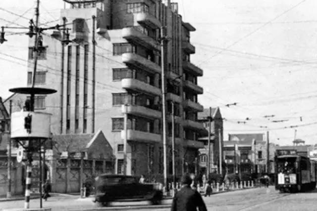
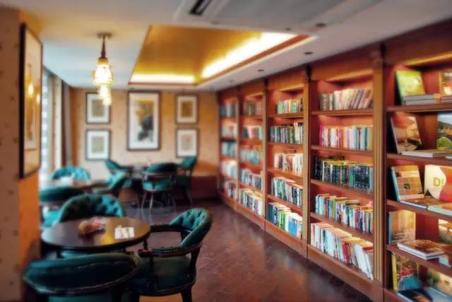
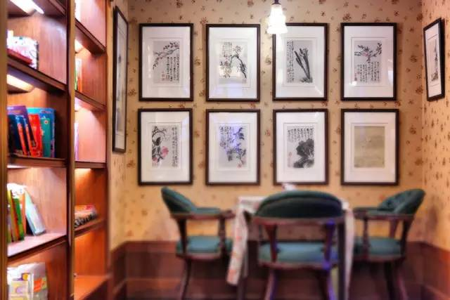
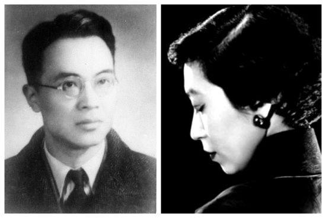

# 千彩书坊Eileen Books+

**千彩书坊**是一家以张爱玲概念为主题，融合了书籍、绘画、文化活动、音乐电影、咖啡茶饮的复合休闲空间，位于张爱玲故居常德公寓一楼。

#### 营业时间

>:alarm_clock:**时间**：周一到周日10:00-22:00（至2022.7.7暂未营业）

#### 地址交通

>:house:**地址**：上海市静安区常德路195-3号常德公寓底商（近南京西路）
>
>:tram:**地铁**：2号线静安寺站/7号线静安寺站
>
>:bus:**公交**：静安寺（南京西路）站/愚园路胶州路站/铜仁路南京西路站

#### 联系方式

>:iphone:**微信**：千彩书坊
>
>:iphone:**座机**：021-62499006

#### 历史背景

千彩书坊位于常德公寓一楼，常德公寓原名爱林登公寓，位于常德路(原赫德路)195号，8层，钢筋混凝土结构，占地面积为580平方米，建筑面积为2663平方米，建于1936年。

公寓原为意大利房产，居住者多为社会中上层人士。著名的女作家张爱玲曾经在这幢楼的1室生活了5年左右，女作家陈丹燕在《上海的风花雪月》一书中有一篇张爱玲的公寓的描述:"张爱玲的家，是在一个热闹非凡的十字路口，那栋老公寓，被刷成了女人定妆粉的那种肉色，竖立在上海闹市中的不蓝的晴天下面。"

20世纪50年代，张爱玲离开上海暂居香港，后来定居美国，1995年中秋节前夕死于纽约寓所。由于张爱玲名声传外，至今仍有不少人到常德公寓寻找张爱玲的家，拍照片拍录像。

#### 经营现状

位于上海常德路近南京西路的常德公寓底楼的千彩书坊，地处老上海静安寺地区的中心区域，把过去与今天的时间空间巧妙的交汇在了一起。坐在历经八十年建筑的院落之中，望到的是一路之隔的静安嘉里中心，而宏安瑞士大酒店、芮欧百货、晶品购物中心、久光百货环伺而邻。

千彩书坊是一个融合了书籍、绘画、文化活动、音乐电影、咖啡茶饮的复合休闲空间。推开窄门，迎面而来的是整面书墙和承载历史的画作图片，书架上满满陈列着的，是包括张爱玲在内的一众女性文学作品。店内装潢颇具老上海风情，旧式的皮箱、暗色花纹的墙纸、吧台上播放着《天涯歌女》的喇叭型老留声机，都让人仿佛回到张爱玲曾生活在这里的时代。书坊共两层加一间露天的院子，皆有桌椅供客人休息。

（常德公寓五楼张爱玲故居现已成为居民住宅区，不开放参观。）

#### 趣闻轶事

!!! abstract "饮品“倾城之恋”"
    

    细细打量这幢六十年前，张爱玲与姑姑相依为命生活时间最长的公寓，那里有张爱玲喜欢的能览市景的大阳台，“阳台外是全上海在天际云影日色里，底下电车当当来去”。当年张爱玲的寓所在五楼，而一楼的咖啡馆，是她常去的地方。在那里她的笔下流出许多精致俏丽的故事，经典作品《倾城之恋》便是其中之一。
    
    由此，店里甚至有一种名为“倾城之恋”的饮品，满溢着咖啡和玫瑰香，分别代表白流苏和范柳原，上面略带苦味的咖啡代表他们之前遇上的坎坷往事。调和后，咖啡的先苦后甜，代表生命里迟来的爱，让他们重获新生。
    
    依然静匿在常德公寓老楼的千彩书坊亦如同重获新生一般，却始终摆脱不了它的文艺气质，之所以千彩书坊保留了“Eileen Literary House”，也是因为始终缠绵于张爱玲的印记之中无法自拔，在千彩书坊驻足的朋友，宛若在小说和现实之间游离，或阅读或沉思，亦或在调侃一句对面的朋友后抿一口咖啡。

!!! abstract "张爱玲与胡兰成"

    1939年，张爱玲与母亲和姑姑住在五十一室，爱丁顿公寓的小阳台是她窥伺世间百态的窗口：“看着上海第一辆有轨电车慢腾腾驶到终点站，看着对面房产大王程霖生破产、程公馆和里边的古玩字画被四明银行没收，看着下午四点的阳光斜斜地射进起士林咖啡馆的玻璃窗，犹豫着要不要走点远路，一杯咖啡下去，一个人物就跳了出来。”
    
    1942年，张爱玲搬进了六十五室，直至1948年，她和这个世间百态都成为了传奇：期间，她以《第一炉香》名声大噪，又陆续发表了《倾城之恋》、《金锁记》、《沉香屑》、《封锁》、《心经》、《花凋》等作品，创作生命达到最为旺盛的时期，令读者如痴如醉。
    
    
    
    也是在这幢公寓里，张爱玲与胡兰成开启了一场旷世之恋。
    
    当年，胡读到了一篇张的作品，便对这位充满才情的女子产生了极大的好奇。几经辗转，打听到了张爱玲的住处，便是爱丁顿公寓。
    
    从门缝里递进去一张字条，张爱玲第二天便去了电话，说要主动拜访胡兰成。可见面之后，胡兰成只说与他所想的全不对。他一是觉得张爱玲个子之高，二是觉得她坐在那里，不象个作家，倒象个未成熟的女学生。让张爱玲哭笑不得。
    
    这一年，胡兰成38岁，张爱玲24岁。
    
    但很快，他们恋爱了。当时世人并不了解他们之间的感情，只觉得胡兰成的政治身份是汉奸，又有妻室，年纪大到几乎可以做张爱玲的父亲。世人都觉得这样的爱情似乎有些不可思议，都是为张爱玲惋惜的。唯独她却不觉得。后来的后来，胡兰成去了武汉，结识了另一位让他魂牵梦绕的女子，也导致了他们爱情的终点。

??? info "参考文章链接"

    *1.[千彩书坊极简介 千彩书坊在哪→MAIGOO百科](https://www.maigoo.com/citiao/171323.html)*
    
    *2.千彩书坊微信公众号*