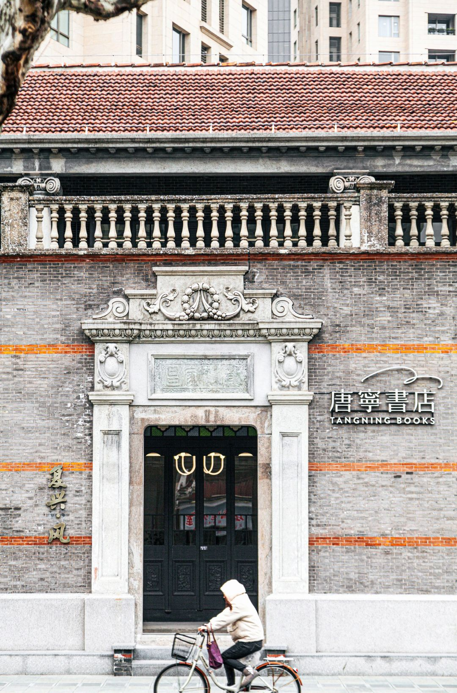
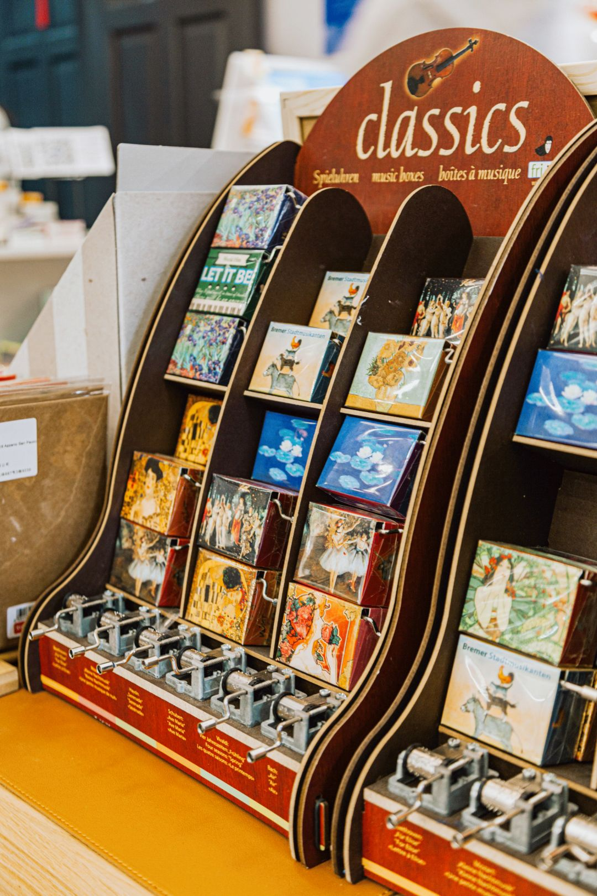
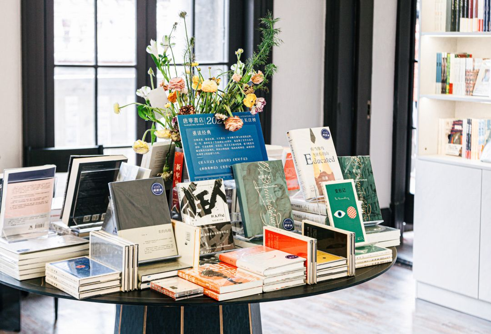
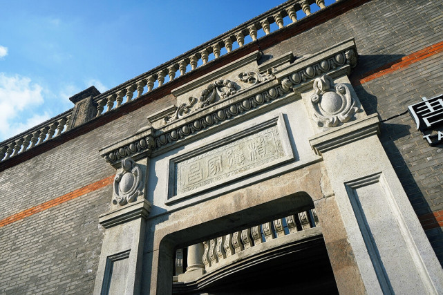

# 唐宁书店

**唐宁书店**坐落在复兴中路118号，毗邻上海新天地与一大会址。唐宁书店在广州是一家老牌的独立书店。自2003年广州第一家店起已经营19年，从早期服务于CBD人群，到后来成为复合型文化生活书店，到今天成为与社区共生共的精品书店，变化、 迭代的是做书店的理念，不变的是做好书店的初心。

<figure markdown>
  
  <figcaption>（图片来源于网络）</figcaption>
</figure>

#### 营业时间

>:alarm_clock:**时间**：周一至周日 10:00-22:00

#### 地址交通

>:house:**地址**：上海市黄浦区复兴中路118号
>
>:tram:**地铁**：8/10号线老西门站5号口步行290米
>
>:bus:**公交**：顺昌路复兴中路

#### 联系方式

>:fontawesome-brands-weibo:{.weibo} **微博**：唐宁书店
>
>:telephone: **手机/座机**：18321151022/021-63356183

#### 历史背景

在北京长大并专攻设计的张小姐，与在北京读金融投资的鲁小姐相遇，她们深感广州的文化氛围不够浓烈，希望在这一块热土搞出点名堂。她俩把这个想法告诉读营销的简小姐，三人一拍即合。三个爱读书的女孩子经过一番艰难的自筹资金，找到世贸新天地旗下的物业，一个旺中带静的地方，决定干一番轰轰烈烈的文化事业。她们起了一个意味深长的名字——唐宁文化传播有限公司。

唐朝，中国最鼎盛时期，文化多元而又博大精深，呈现了文人理想的生活状态，而“宁”，则是中国知书识礼之人所追求的一种至高意境。“宁静以致远”也是现代人需要的良好境界。这就是“唐宁”的解释与用意。

#### 经营现状

唐宁书店根据每个厅的不同主题，搭配了造型各异、极具东方韵味的古董灯具，美轮美奂。

作为一家贴近生活气息的综合型书店，除了书籍外，还有文创、香氛、国潮等区域，还有一层暂未对外开放的神秘古董书籍区域。

一楼的空间主要以上海为主题，分为“唐宁新书厅”和“上海118”两个区域。在进门处的“唐宁新书厅”里，展示着一些关于老上海的文创周边，如八音盒、复古插画册、怀旧CD等，而里面的“上海118”厅，则摆放着不少与上海文化与消费趋势的生活相关书籍，也有上海代表作家，中国现古代相关文化书籍，如大上海、城市印象等书刊，让读者轻轻翻阅就能感受上海的社会变迁。除了书籍这里还摆放着国货品牌供大家参观和购买。

<figure markdown>
  
  <figcaption>（图片来源于网络）</figcaption>
</figure>

顺着“上海118”里面通往2楼的老旧楼梯，到达二层空间，分别是文学书房、香水客厅、童趣厅和闲廊四个区域，每个房间都清新雅致，给人一种怡然自得的感觉。在房间C位的文学客厅里，陈列了大量中西方文学书籍和推理小说等书籍。

<figure markdown>
  
  <figcaption>（图片来源于网络）</figcaption>
</figure>

隔壁是香水客厅，这里售卖的商品以国货香氛、香水为主还搭配了些精美茶具、饰品等小物件供客尽情选购；房间的另一头是儿童厅，五彩缤纷的房间童趣十足，里面涵盖了儿童读物、玩具等，还设置了一处阅读天地，俨然就是孩子们的快乐天堂。

而二楼的闲廊，这里明亮宽敞、安静舒心，供客人休闲拍照，感受书店想提供给读者的安逸感受和建筑厚重的

<figure markdown>
  
  <figcaption>（图片来源于网络）</figcaption>
</figure>

唐宁书店上海复兴店期望能与新国货品牌碰撞出新的火花，让新国货主理人们相聚在唐宁书店，讲述自己品牌的开创故事，交流品牌运营主理过程中的得失，助力国货复兴。未来唐宁书店将联合众多新国货品牌，把最具趋势的生活设计带给每一位来到唐宁书店的读者，使书店的读者和顾客们一起收获美的生活方式，创造美，体验美。

#### 趣闻轶事

!!! abstract ""

    这是一栋建造于1925年的石库门院落，黑瓦、清水砖、女儿墙，门头上的浮雕，都有着典型的上海民居特色。原本坐落在绍安里2号，主人家姓沈，所以被称为“沈家老宅”。如今，老宅被修复之后，迁移到这里，与常见的石库门建筑略有区别的是，沈家老宅那中西合璧的特色更明显。二楼原建筑主卧之外，设计有欧式的弧形阳台，楼上楼下还装饰以8根羊角造型的罗马柱。书店保留了大宅原有的“中轴线对称”格局，利用不同房间陈列不同主题图书。

    这座建筑的特色，凸显在一楼的绍安庭与二楼的闲廊、探花亭，绍安庭位于书店入门，为匆忙来到此地的读者一个缓冲过渡，闲廊与探花亭也为读者们提供一个停留与建筑共鸣的空间，每个区域的功能与建筑的特色相互融合。逛店时不同空间交替出现，也令人产生移步换景的感受，完成在第四空间内观照、共享、独处的游历循环。

    <figure markdown>
    
    <figcaption>（图片来源于网络）</figcaption>
    </figure>

??? info "参考文章链接"

    *1.[黄浦日记｜百年石库门变身唐宁书店，把生活烟火气延续到未来](https://baijiahao.baidu.com/s?id=1724075713191416574&wfr=spider&for=pc)*
    
    *2.[百度百科-唐宁书店](https://baike.baidu.com/item/唐宁书店/10311797?fr=aladdin)*
    
    *3.[上海唐宁书店：建筑很美，书店一般](https://xw.qq.com/cmsid/20220627A033L200)*

    *4.[魔都再添新书店，在广州火了19年的唐宁书店来了～](https://mp.weixin.qq.com/s/NFZX1FblxZGgnc0inWSvcQ)*

  