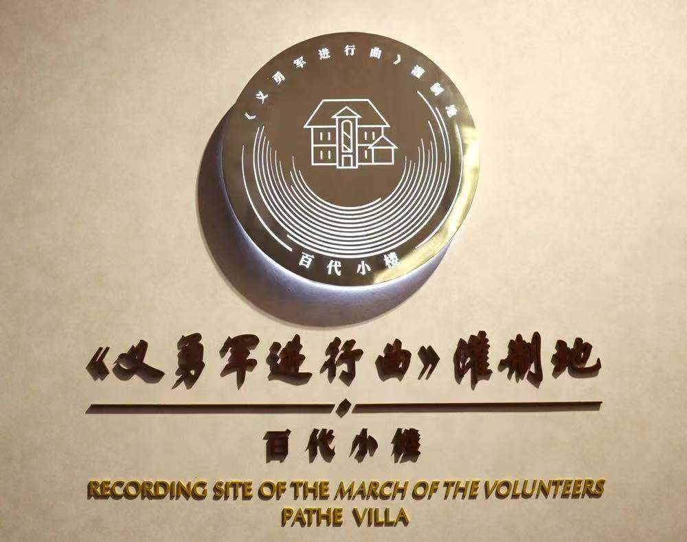
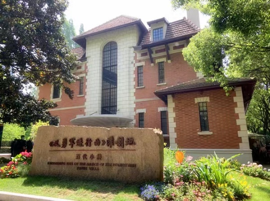
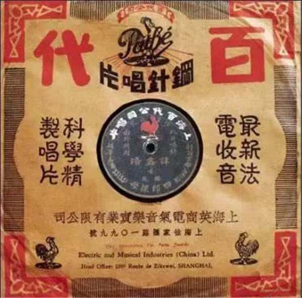

# 百代小楼

**百代小楼**是近代中国唱片工业的代表者和记录者，是中国音乐文化传播的原点。聂耳先生在此谱录灌制了我国的国歌——《义勇军进行曲》。如今，这里成为了徐汇红色文化厚重感和丰富性的文化品牌闪光点，是彰显“海派之源”的新标杆。

#### 营业时间

>:alarm_clock:**时间**：周二至周日9：00-12：00，13：00-17：00（16：30停止入馆）

#### 地址交通

>:house:**地址**：上海市徐汇区衡山路811号
>
>:tram:**地铁**： 9、11号线徐家汇（14号口）地铁站步行15分钟到达/1号线衡山路（1号口）地铁站步行13分钟到达
>
>:bus:**公交**：855路公交车广元西路恭城路步行15分钟到达/830、15、824、93路公交车衡山路宛平路步行2分钟到达

#### 联系方式

>:iphone:**座机**：021-54259260

#### 历史背景

1908年，法国百代公司在上海成立柏德洋行，发展中国及远东地区的唱片、留声机、电影等业务。柏德洋行后更名为百代公司，在上海徐家汇建起了中国第一架唱片厂、第一座录音棚。1920年底，百代唱片制造厂在徐家汇落成，正式投产，第一批中国制造的唱片在徐家汇诞生。1934年，因法国百代公司前期已被英商收购，上海百代公司注册更名为上海英商电气音乐实业有限公司，英文简称EMI。

鉴于百代唱片的品牌影响力，“百代”品牌和“雄鸡”商标被继续沿用。1952年1月5日，上海唱片厂在百代公司的原址上成立，两个月后发行第一张唱片《我们要和时间赛跑》。1953年更名为上海人民唱片厂，1955年更名为中国唱片厂，唱片牌号定位“中国唱片”，“天安门”与“华表”成为新的商标图案，沿用至今。1982年中国唱片总公司成立，此处改为中国唱片上海公司。2001年因徐家汇绿地工程，唱片公司整体动迁，衡山路811号百代小楼得到保留。

2004年1月，徐汇区人民政府公布为徐汇区文物保护单位。2005年10月，上海市人民政府公布为优秀历史建筑。2021年3月，上海市文化和旅游局公布为上海市第一批不可移动革命文物。

#### 经营现状

2021年4月，在中国共产党百年华诞之际，恰逢国歌录制八十六周年，百代小楼作为国歌《义勇军进行曲》的灌制地，经过精心布展，正式对外挂牌开放。展陈充分体现了国歌的丰富内涵、精神力量和时代特征，把徐汇红色文化的厚重感和丰富性转化为文化品牌的闪光点，彰显“海派之源”新标杆。如今，是徐汇区红色文化建筑的一大标杆级特色打卡点。

#### 趣闻轶事

!!! abstract ""
    

    上海市中国现代音乐文化的策源地，百代小楼是近代中国唱片工业的代表者和记录者。百代唱片作为音乐文化传播的原点，为时代留声、为历史留痕，为后世留下了众多脍炙人口的经典曲目。
    
    冼星海、梅兰芳、谭鑫培、周璇、胡蝶等都曾在这里留声录片。1934年，聂耳担任百代公司音乐部副主任，1935年5月3日，他谱录的《义勇军进行曲》在此首次灌制。1949年9月27日，中国人民政治协商会议第一届全体会议通过，以《义勇军进行曲》为代国歌。2004年3月14日，十届全国人大第二次会议通过宪法修正案，明确“中华人民共和国国歌是《义勇军进行曲》”。2017年9月1日，《中华人民共和国国歌法》获十二届全国人大常委会第二十九次会议表决通过，于2017年10月1日起施行。

??? info "参考文章链接"

    *1.[百代小楼（《义勇军进行曲》灌制地）_百度百科 (baidu.com)](https://baike.baidu.com/item/百代小楼（《义勇军进行曲》灌制地）/56312104)*

    2.[党史学习 | 国歌从这里响起！百代小楼——《义勇军进行曲》灌制地揭牌 (thepaper.cn)](https://m.thepaper.cn/baijiahao_12493289)