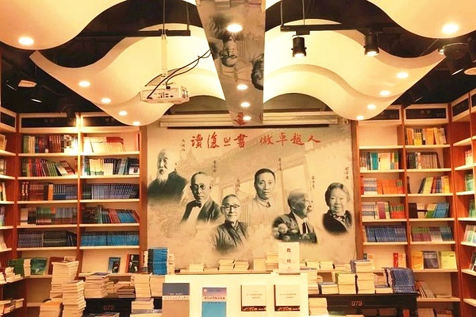
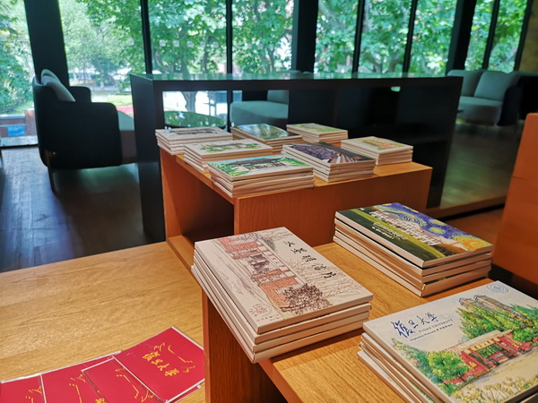
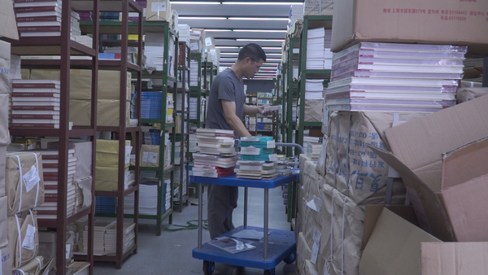
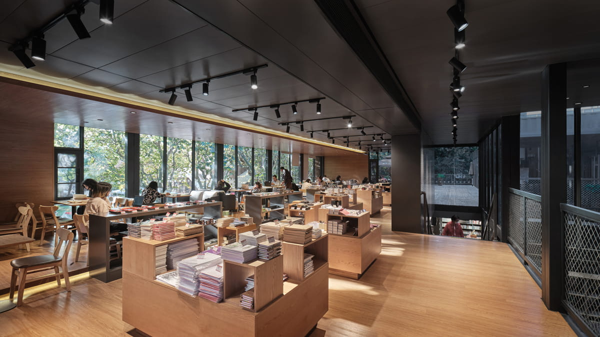

# 复旦经世书局

**复旦经世书局**是隶属于复旦大学出版社的综合性书店，自1993年起经营了27年后迁址重开，现坐落于国权路579号复旦大学旁。新经世书局实现了整体的优化升级，不断将优质高校书店资源辐射给更多的人群。

<figure markdown>
  
  <figcaption>（图片来源于网络）</figcaption>
</figure>

#### 营业时间

>:alarm_clock:**时间**：周一到周日 9：30-21：00

#### 地址交通

>:house:**地址**：上海市杨浦区国年路286号
>
>:tram:**地铁**：地铁18号线复旦大学站2口步行650米

#### 联系方式

>:fontawesome-brands-weixin:{ .weixin }  **微信公众号**：复旦经世书局
>
>:telephone: **座机**：021-65102580

#### 历史背景

复旦经世书局原址坐落在国权路579号，初始是复旦大学出版社的读者服务部，创办于1993年，店名为“普雷斯”，是英文单词“出版社”（press）一词的音译。3年后，与复旦大学出版社渊源颇深的南怀瑾提议改名为“经世书局”并题写店名，“汇聚古今中外文化，学以经世而致之用”理念延续至今。

曾经，复旦大学邯郸校区周边分布着大大小小10多家书店，有左岸书店、万象书坊、心平书店，庆云书店等，新世纪第一个十年之交，高校书店逐渐从高校版图中消失，在那股闭店潮中，经世书局经营也进入低谷。2015年底，经世书局重新装修，由旧时的400平方米，扩展到了530平方米，还增设了文艺气息浓郁的休闲区域，同时调整了图书选品，优化图书品种，加快新书订货。改良后书店实现了零售额的增长，到店读者人数大幅上升，读者在书店停留的时间也大幅增加。

<figure markdown>
  
  <figcaption>（图片来源于网络）</figcaption>
</figure>

#### 经营现状

因复旦大学整体规划调整和18号线国权路站的建设，经世书局于2020年从旧址（国权路579号）搬出，并选择在国年路286号重新“落户”。

<figure markdown>
  
  <figcaption>（图片来源于网络）</figcaption>
</figure>

书局分上下两层，实用面积达1000平米，整体尝试了极具现代感的木质加集装箱的主体结构，高低书架纵深错落，极具层次感。走进全新的经世书局，先映入眼帘的是复旦大学出版社出版的重点人文社科类书籍，除此之外还设有知名出版社专架，如商务印书馆、中华书局、上海古籍出版社、中信出版社、世界知识出版社、社会科学文献出版社·甲骨文系列等等，由此可见，经世书局的图书品类选择以人文社科与艺术类为主，和复旦大学的学科特色交相呼应，一楼咖啡吧台还设计了临街窗口，店内还提供自助扫码购书和查询服务。

书店二楼是一个更广阔的开放空间，以休闲及文创陈列售卖为主，一上来便能透过一排落地玻璃窗看到对面的第五教学楼，一旁还有全新的露台，书店拥有独立活动空间，会展、读书会、培训等相关附属功能在整个二楼区域展开。

<figure markdown>
  
  <figcaption>（图片来源于网络）</figcaption>
</figure>

尤为特别的是，书店采取前门店后仓储形式，一楼门店背后就是仓库，可以保证最新品类图书上架，减少门店复本、增加品种，提高书店对读者需求的满足效率，提升门店周转率。书局同时经营了一家天猫网店，网店售出的书籍也从该仓库发货。

<figure markdown>
  
  <figcaption>（图片来源于网络）</figcaption>
</figure>

搬迁后书局进行了全新升级，融入了更多的文化功能，也为读者提供了更多的文化服务。书局在一楼设立了咖啡吧，为读者营造了悠闲轻松的阅读氛围；同时书局引进了新的文创产品来凸显书店特色；二楼还特意开辟了一间能容纳60-80人的备用室，计划在这里定期举办新书发布会、名家签售会、好书分享会等各种形式的读书活动；前门店后仓储的设计，更是增加陈列品种，加快周转速度，促进线上线下全新融合。

#### 趣闻轶事

!!! abstract ""

    复旦经世书局的建筑、室内、景观由水石设计米川工作室设计。书局所在的国年路是带有校园独特气息的静谧小马路，路两侧是枝叶茂盛的法国梧桐，充分发挥出场所特质是设计的出发点。

    在外部，实体墙体部分作为光影变化的载体，同时能有效的遮挡西晒，内部则是整面的展示性书架墙。实体之间的虚体部分则起到对环境进行反射的作用，同时形成橱窗效应。与书架墙体共同构成一个个单人位的读书角，在整个界面中营造街景中“看与被看”的意趣，形成建筑空间与街道环境的对话关系。

    为了保证建构与形式的统一，整个建筑只 出现两种色彩：深灰色和木色，形成一冷一暖的对比色。

    如今书局中的大部分空间都被很好地利用，人在建筑中很会自然地融入到琐碎日常的场景里，整个空间呈现出一种包容的状态。

    <figure markdown>
    
    <figcaption>（图片来源于网络）</figcaption>
    </figure>

??? info "参考文章链接"

    *1.[开了27年的复旦经世书局新址新开，上海高校书店有这些好消息告诉你](https://new.qq.com/omn/20200617/20200617A0OS8600.html)*
    
    *2.[复旦经世书局重开，来看“升级版”校园书店会带来哪些惊喜？](https://www.thepaper.cn/newsDetail_forward_7881732)*