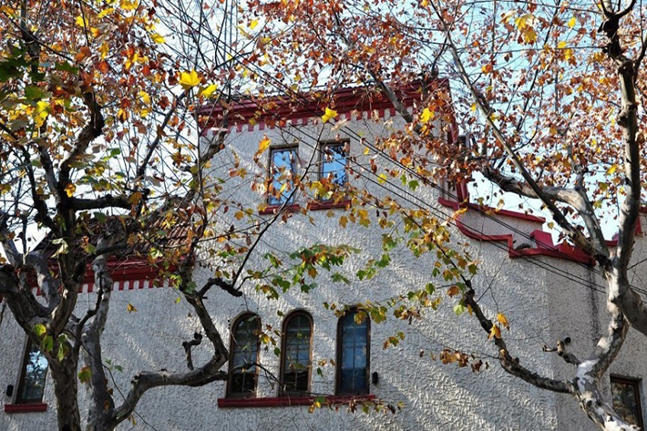

# 衡山·和集

**衡山·和集**是上海近代海派民居的典型样本，建于上世纪30、40年代民国建筑发展的鼎盛时期，涵盖花园洋房及新式里弄建筑，堪称东西方建筑文化融合的缩影。许多民国时期的文化工作者曾居住于此，这也是红色文化的一大重要传播地。

#### 营业时间

>:alarm_clock:**时间**：周一至周日 7:30-22:00

#### 地址交通

>:house:**地址**：上海市徐汇区衡山路880号
>
>:tram:**地铁**：9、11号线徐家汇地铁站步行10分钟到达
>
>:bus:**公交**：72路公交车天钥桥路辛耕路（徐家汇）公交站步行8分钟到达/836路公交车徐家汇公交站步行5分钟到达

#### 联系方式

>:telephone:**座机**：021-54245722

#### 历史背景

衡山坊原名“树德坊”,曾是上海滩颇具知名度的高档住宅区,吸引了众多文人雅士聚居于此。作为近代海派民居的典型样本，衡山坊的特别之处在于南北不同样式建筑并存，创造了灵动的空间变化。

北部新里建于1934年，属于上海典型的弄堂住宅。南部花园洋房建于1948年，由洽盛地产公司建造，借鉴西方建筑，采用砖木混合结构，对中国传统建筑的木构结构是一次创新。

<figure markdown>
  
  <figcaption>（图片来源于网络）</figcaption>
</figure>

前者属于砖木结构联排新式里弄，后者为砖木结构独栋花园洋房。树德坊和衡山村均是建造年代的典型范式：新里高3层，2层处有局部退台，每个单元外设低矮的围墙，靠南侧一排新里的南立面一层有地中海风格的拱券，红色筒瓦双坡屋面，带老虎窗；花园洋房均为3层楼，红色筒瓦坡屋面，墙面转角处以石材包角作为装饰，造型简洁。

#### 经营现状

经过修缮，如今的衡山坊不但保留传承了老上海文化历史的精髓，还通过现代感的设计理念重塑了摩登时尚的生活格调。该项目由11幢独立花园洋房及两排典型上海新式里弄住宅组成。北部新里集合了创意办公、艺术空间及异国美食，南部花园洋房主要以精品零售店为主。

<figure markdown>
  
  <figcaption>（图片来源于网络）</figcaption>
</figure>

完整呈现了原有建筑的肌理与空间形态的同时，重现上海里弄神韵又巧妙融入现代商业元素，划分出“艺术与创意办公”、“精品商业”、“精致生活”、“极致美食”四大板块，打造一处独具上海魅力的城市慢生活街区。

#### 趣闻轶事

!!! abstract ""
    <figure markdown>
    
    <figcaption>（图片来源于网络）</figcaption>
    </figure>

    1932年起,中国电影史册上公认的经典电影导演费穆就曾居住在这里,其代表作有《小城之春》、《城市之夜》、《狼山喋血记》。费穆的家经常有电影界、话剧界人士拜访,座上客有京剧大师梅兰芳、姜妙香以及著名电影演员刘琼等。

    中国第一位独立执业女建筑师张玉泉当年也居于此,与同为建筑师的丈夫费康创办了“大地建筑师事务所”,留下西班牙建筑风格的“浦园”等众多杰出的建筑作品。

    1937年旅居于此的罗淑女士是与冰心、庐隐、凌叔华、萧红、沉缨、施济美、冯沅君、陈衡哲等齐名的民国十大女作家之一，也是被巴金誉为“社会革命的斗士，中国的一个优秀女儿“的革命人，在此写下了很多红色文化书籍读本。

??? info "参考文章链接"

    *1.[衡山坊介绍](http://www.qjtrip.com/m/I.aspx?Id=3727)*

    *2.[百度文库——衡山·和集](https://wenku.baidu.com/view/bbb3849f29160b4e767f5acfa1c7aa00b42a9def.html)*