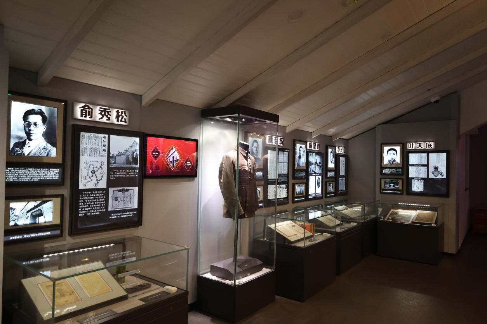

# 渔阳里（中国社会主义青年团中央机关旧址纪念馆）

上海共有两条名为**渔阳里**的弄堂，其中黄浦区淮海中路567弄（新渔阳里）是中国社会主义青年团中央机关旧址纪念馆，建筑面积1016.8平方米，隶属关系于黄浦区文化局，是社会科学类历史遗址博物馆。

#### 营业时间

>:alarm_clock:**时间**：周二到周日：9:00-11:00（10:45停止入场），13:00-16:00（15:45停止入场）周一不开放

#### 地址交通

>:house:**地址**：上海市黄浦区淮海中路567弄1-7号
>
>:tram:**地铁**：13号线淮海中路站/14号线一大会址·黄陂南路/1号线一大会址·黄陂南路
>
>:bus:**公交**：淮海中路思南路/淮海中路重庆南路/兴业路重庆南路/成都北路/瑞金一路淮海中路

#### 联系方式

>:telephone: **座机**：021-53823370

#### 历史背景

1920年6月，陈独秀在上海发起成立了中国共产党的第一个早期组织：中国社会主义青年团。 

1921年11月，中国社会主义青年团临时章程中明确规定：在“正式团的中央机关未组成时，以上海团的机关代理中央职权”。

1922年春，中国社会主义青年团临时中央局迁址大沽路356—357号（今大沽路400—402号）。

1954年，中共上海市委宣传部先后送发了《关于上海革命历史纪念馆问题的请示》和《关于成立革命历史纪念馆、渔阳里6号团中央机关与中共“一大”的第一馆》的文件。文件中首次提出将渔阳里6号恢复为举办“外国语学社”时的面貌布置。

1956年初，中共上海市委作出批示，解决了渔阳里5、6、7号居民的动迁问题，将整个旧址从民宅中置换了出来。

1957年底，房屋复原修绥工程告竣，实行对内预约参观。

1961年3月4日，中国社会主义青年团中央机关旧址被国务院公布为全国重点文物保护单位。

1986年，共青团上海市委向中共上海市委请示，在渔阳里旧址的基础上筹建中国社会主义青年团中央机关旧址纪念馆。

1988年，再次对渔阳里团中央机关旧址按原貌进行大修。

2001年，中共上海市委和共青团中央决定对团中央机关旧址进行全面改建和整修，并成立旧址纪念馆，对公众开放。

2002年12月底，国家文物局正式批准团中央机关旧址整修方案。

2003年4月10日，团中央机关旧址整修工程正式启动。

2004年4月26日，纪念馆建成并对外开放。

<figure markdown>
  
  <figcaption>（图片来源于网络）</figcaption>
</figure>

#### 经营现状

中国社会主义青年团中央机关旧址纪念馆建筑面积1016.8平方米，其中1—5号为纪念馆，分为序厅、中国青年英模展厅、上海青年运动史展厅（动态展厅）和‘渔阳里’团中央机关旧址历史展厅四个部分。6号建筑面积为174.8平方米，建筑风格属典型的上海石库门建筑，为团中央机关旧址的复原陈列。

第一部分：序厅，该展厅通过30米长的巨幅铜板壁画再现了80多年来中国青年运动历程。同时运用电视林手法和灯光变化，将《渔阳里》导览片和整体环境融为一体。

第二部分：中国青年英模展厅，该陈列重点展示了五四运动以来的33位青年英模和英模集体的感人事迹。展厅在综合运用历史照片、实物、艺术品、模拟场景、三面翻等传统布展手段的基础上，增加了多媒体和互动项目的比重，如可双人比赛的“学雷锋”网络游戏，可检索、点播的团史触摸屏、“英模走廊”等。展厅中的多媒体设备，可以为观众放映反映当代青年穿越时空与英模交流的多媒体短剧，短剧采用大屏幕投影、动态布景、幻影成像等合成技术，开创了国内同类制作的先河。

第三部分：团中央机关旧址历史展厅，该陈列主要反映从民国八年（1919年）五四运动至民国十一年（1922年）团“一大”召开的历史。展厅分四个展区：第一展区介绍五四运动爆发的时代背景；第二展区介绍上海建团的过程；第三展区介绍全国建团的情况；第四展区展示了从渔阳里6号走出来的以刘少奇、任弼时、俞秀松、罗亦农、萧劲光为代表的一批著名人物。历史展厅以历史照片、实物、幻影成像、场景等为主要展示手段。

<figure markdown>
  
  <figcaption>（图片来源于网络）</figcaption>
</figure>

第四部分：上海青年运动史展厅，该展厅通过图片展示了八十多年来，上海青年在新民主主义革命时期、社会主义建设时期和改革开放时期及建设社会主义现代化的进程中创造的业绩。

第五部分：团中央机关旧址复原场景，该部分复原了当年团中央机关的内部陈设，再现了当年团中央机关、上海社会主义青年团和外国语学社的原貌。

<figure markdown>
  
  <figcaption>（图片来源于网络）</figcaption>
</figure>

#### 趣闻轶事

!!! abstract "馆藏文物与重要藏品"
    
    中国社会主义青年团中央机关旧址纪念馆藏品来源广泛。2003年团中央机关旧址整修工程启动后，上海社会主义青年团第一任书记俞秀松烈士的遗孀安志洁女士（现已去世）将珍藏半个多世纪的烈士遗物捐献给纪念馆。原外国语学社教师王元龄、曾在外国语学社学习的经济学家周伯棣等家属在得知旧址改扩建消息后，也捐献了一批珍贵文物用于纪念馆展出。上海造币厂特制了一枚重达一公斤的纯金团徽捐赠给纪念馆。 截至2019年末，中国社会主义青年团中央机关旧馆藏品有36件/套。

    中国社会主义青年团中央机关旧址纪念馆重要藏品有：山西省团委捐赠的刘胡兰被害时用过的侧刀（复制品）；上海社会主义青年团第一任书记俞秀松戴过的眼镜、用过的笔筒、镇纸；刘少奇填写的《团员调查表》（复制品）；周伯棣著的《中国财政史》手稿等书籍，介绍了旧址纪念馆筹备建设的整个过程及中国社会主义青年团中央机关的历史变革。
    
    <figure markdown>
    
    <figcaption>（图片来源于网络）</figcaption>
    </figure>

??? info "参考文章链接"

    *1.[百度百科——中国社会主义青年团中央机关旧址纪念馆](https://baike.baidu.com/item/%E4%B8%AD%E5%9B%BD%E7%A4%BE%E4%BC%9A%E4%B8%BB%E4%B9%89%E9%9D%92%E5%B9%B4%E5%9B%A2%E4%B8%AD%E5%A4%AE%E6%9C%BA%E5%85%B3%E6%97%A7%E5%9D%80%E7%BA%AA%E5%BF%B5%E9%A6%86/16975864)*
    
    *2.[百度百科——渔阳里](https://baike.baidu.com/item/%E6%B8%94%E9%98%B3%E9%87%8C/283483?fr=aladdin)*
    

