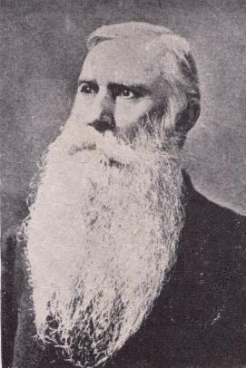
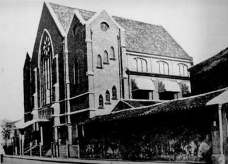
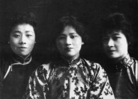
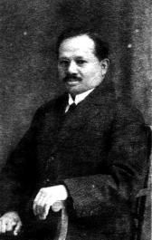
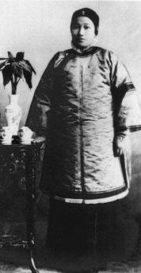
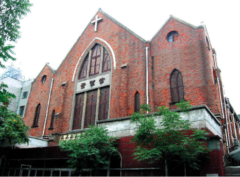
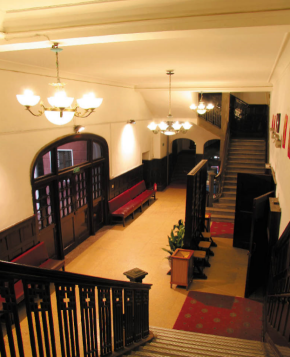
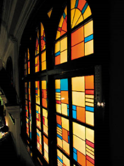

# 景林堂

景林堂位于昆山路135号，以美国基督教传教士林乐知得名。

林乐知（1836-1907，Young John Allen）是美国基督教监理会传教士，1859年来华。1864年后，任上海广方言馆英文教习、江南制造局翻译馆翻译等。1868年，应英商字林洋行之聘，任中文《上海新闻》主笔。同年创办中文期刊《中国教会新报》，1874年改名为《万国公报》，该报是近代中国影响最大的报纸之一。1882年，林乐知在虹口昆山路创办中西书院，招收中国学生，以英文和中文同时教习。后来，中西书院与苏州博习书院合并为东吴大学，即现在苏州大学的前身。中西书院内有一个学校教堂，称之为“监理会堂”。1907年林乐知逝世后，为了纪念林乐知，监理会和学校把这个教堂重新命名为Allen Memorial Church，就是“林乐知纪念教堂”，中文名称“景林堂”，即“景仰林乐知”的意思。

中西书院迁到苏州后，上海校舍为东吴大学附属第二中学，简称“东吴二中”。1923年，东吴二中升级为东吴大学法学院，在旧校址东侧建设新校舍。同时，在新校舍对面（今昆山路135号）重建景林堂。新建教堂为砖混结构，坐南朝北，出入口开在昆山路上。北立面及西立面上的尖拱窗为哥特式。建筑平面呈拉丁十字形，主入口立面为三个对称排列的山墙构图；中间大山墙有贯通两层的尖拱窗，其下部有三叶拱带饰，两旁为扶壁柱；教堂的底层为假层，礼堂在一层和二层为通层，总面积为1067平方米，可容纳1500余人。

宋庆龄、宋美龄的父亲宋嘉树是基督教监理会牧师，宋家都是监理会忠实信徒。景林堂设有宋庆龄母亲倪桂珍的专用位子。

1980年，景林堂更名为“景灵堂”，恢复宗教活动。1994年2月15日，景林堂被公布为上海市优秀历史建筑。

<figure markdown>
  
  <figcaption></figcaption>
</figure>

林乐知（1836-1907）

<figure markdown>
  
  <figcaption></figcaption>
</figure>

1923年建成的景林堂

<figure markdown>
  
  <figcaption></figcaption>
</figure>

青年时期的宋庆龄（中）宋美龄（右）宋霭龄

<figure markdown>
  
  <figcaption></figcaption>
</figure>

宋嘉树（1863-1918）海南文昌人，字耀如。

<figure markdown>
  
  <figcaption></figcaption>
</figure>

倪桂珍（1869-1931）浙江余姚人。

<figure markdown>
  
  <figcaption></figcaption>
</figure>

2006年拍摄的景林堂

<figure markdown>
  
  <figcaption></figcaption>
</figure>

景林堂入口大厅

<figure markdown>
  
  <figcaption></figcaption>
</figure>

景林堂的彩色玻璃窗

