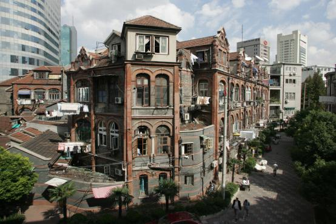
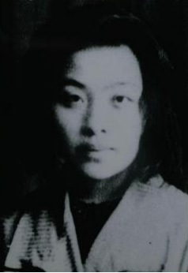
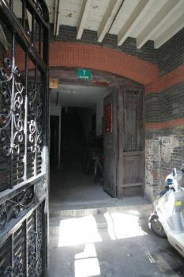
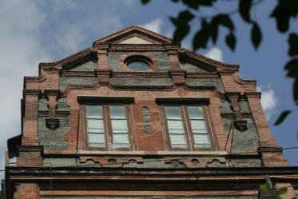
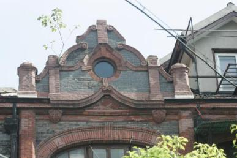
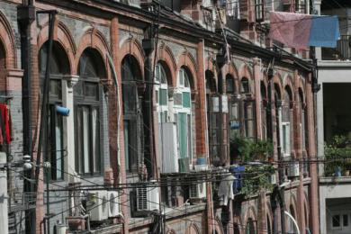

# 昆山花园路住宅

<figure markdown>
  
  <figcaption></figcaption>
</figure>

昆山花园路住宅位于昆山花园路1－10号。

昆山花园路住宅于二十世纪初由美商建造，具有早期古典式低层公寓建筑风格。沿街布置，坐北朝南，砖混结构假四层。平面作矩形，立面连续券柱廊式构图，入口上方三层均建小型阁楼，复式“人”字形屋架，平瓦顶，阶梯形山墙。清水红砖墙面，红砖砌横竖向线条装饰，券式木门窗，有细腻的线脚纹饰。作家丁玲曾在此居住。现为民居。

1999年9月28日，昆山花园路住宅被公布为上海市优秀历史建筑。

<figure markdown>
  
  <figcaption></figcaption>
</figure>

丁玲（1904—1986）原名蒋伟，字冰之，湖南临澧人。著名作家，社会活动家。

<figure markdown>
  
  <figcaption></figcaption>
</figure>

1933年2月，丁玲迁入昆山花园路7号阁楼居住。这里亦为中共地下党联络处。5月14日，丁玲与潘梓年在此被国民党特务绑架，左联诗人应修人来此联系工作，不幸被特务包围，在与特务搏斗中坠楼牺牲。

<figure markdown>
  
  <figcaption></figcaption>
</figure>

昆山花园路住宅入口上方小型阁楼

<figure markdown>
  
  <figcaption></figcaption>
</figure>

昆山花园路住宅阶梯形山墙

<figure markdown>
  
  <figcaption></figcaption>
</figure>

昆山花园路住宅券式木门窗

