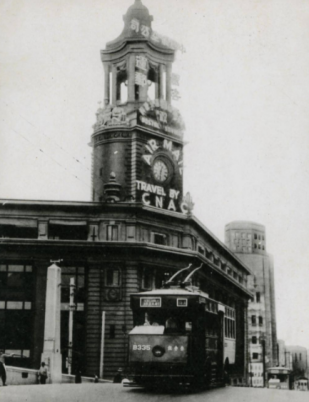
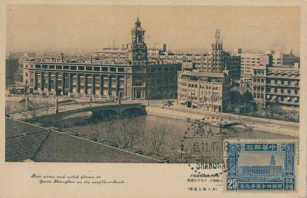
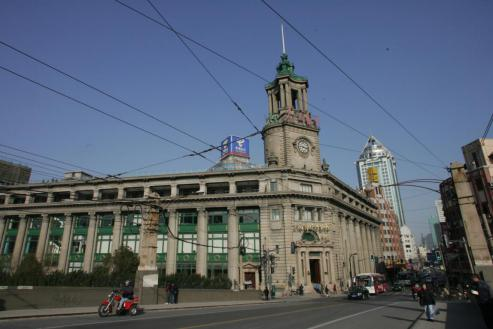
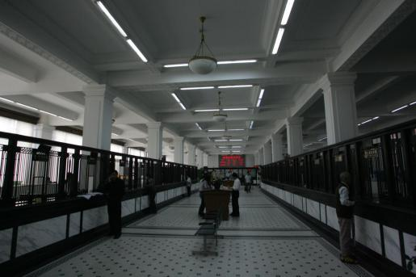
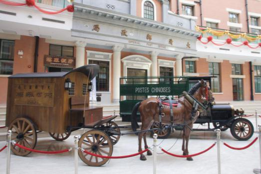
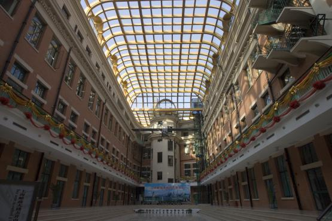
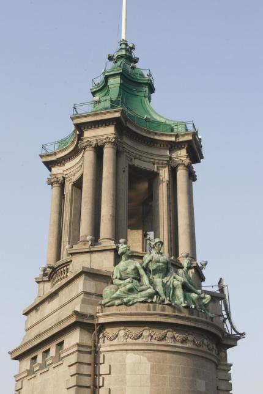

# 邮政总局大楼

邮政总局大楼位于北苏州路276号，初名“中华邮务管理总局”（Chinese Post Office）。

中华邮务管理总局是国家邮政总局，设在上海，也被叫做“上海邮政总局”。原在北京路博物院路转角，1920年后迁四川路桥北堍虹口重建。这里紧靠市中心，东连黄浦江，北近火车站，南距十六铺水运码头不远，邮件的水陆运输十分便利，是理想的邮政枢纽。大楼由英商思九生洋行设计，余洪记营造厂承建，1922年12月奠基，1924年11月竣工。大楼占地面积6500平方米，建筑面积2.53万平方米，钢筋混凝土框架结构，地下一层，地上四层。

邮政总局大楼为欧洲折衷主义建筑形式的代表作。V型平面，三段式划分，基座、檐部各占一层。东南转角圆形，为构图中心。两侧均为主立面，有通贯三层的简化科林斯巨柱式列柱。转角处顶部为钟塔，冠17世纪流行的意大利风格的巴洛克式穹顶。钟楼两侧各有一组三人组成的群雕。一组是每人各执火车头、铁锚和通讯电缆模型，象征铁路、轮船、电信是中国邮政发展的方向，中国邮政将向现代化迈进。另一组居中者为罗马神话中的商业之神墨丘利（Mercury）；墨丘利两侧分别是男女爱神，寓意便捷的邮政可以带来财富，邮政坚持为商业服务，同时，邮政也是司爱之神，为联络异地交流，沟通人们情感发挥巨大的作用。邮政大楼二楼营业大厅面积1200平方米，宽敞明亮、富丽堂皇，素有“远东第一大厅”之称。

邮政总局大楼是中国目前仍在使用的、规模最大、最早邮政标志性建筑。不仅是中国邮政史的见证，同时也为中国现代邮政事业的发展创造了良好的物质条件。现该处为邮政博物馆。

1989年9月25日，邮政总局大楼被公布为上海市文物保护单位。1996年11月20日，邮政总局大楼所在的“外滩建筑群”被公布为全国重点文物保护单位。 

<figure markdown>
  
  <figcaption></figcaption>
</figure>

1939年拍摄的邮政总局大楼

<figure markdown>
  
  <figcaption></figcaption>
</figure>

1947年纪念中华邮政40周年的明信片

<figure markdown>
  
  <figcaption></figcaption>
</figure>

2006年拍摄的邮政总局大楼

<figure markdown>
  
  <figcaption></figcaption>
</figure>

有“远东第一大厅”之称的营业大厅

<figure markdown>
  
  <figcaption></figcaption>
</figure>

邮政博物馆内景

<figure markdown>
  
  <figcaption></figcaption>
</figure>

邮政总局大楼内的中庭

<figure markdown>
  
  <figcaption></figcaption>
</figure>

罗马神话中的爱神雕塑

