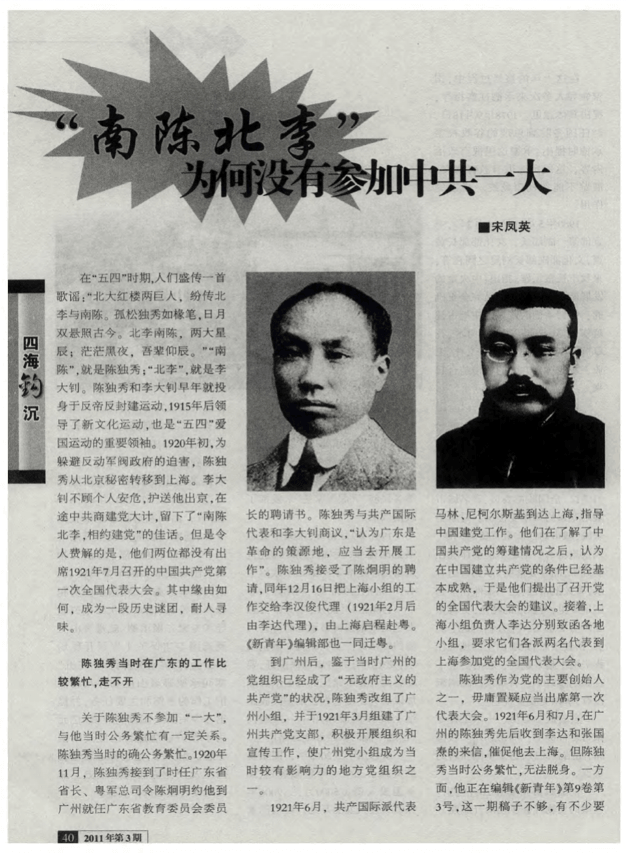

# 上海中共“一大”会址

**中共“一大”会址**位于上海市黄浦区兴业路76号。“一大”会址纪念馆于1952年设立，其原址是两栋砖木结构的两层石库门楼房，是上海20世纪20年代的典型民居，其中一栋是当时“一大”代表李汉俊的家宅，另一栋是文博女校，为当时一大代表的住所。

#### 营业时间

>:alarm_clock:**时间**：周二到周日 上午场09:00-12:00，11:30停止入场/全天  13:00 -17:00，16:30停止入场

#### 地址交通

>:house:**地址**：上海黄浦区兴业路76号
>
>:tram:**地铁**：1号线黄陂南路站/10号线新天地站
>
>:bus:**公交**：太仓路重庆南路（24路、109路、926路等线路）

#### 联系方式

>:fontawesome-brands-weixin:{ .weixin } **微信**：中共一大纪念馆
>
>:fontawesome-brands-weibo:{.weibo} **微博**：中共一大纪念馆
>
>:fontawesome-brands-tiktok:{.tiktok} **抖音**：47121638131
>
>:telephone: **座机**：021-53832174

#### 历史背景

民国九年（1920年）秋，上海法国租界内望志路106号、108号两幢房屋建成，李汉俊、李书城兄弟租用该两栋房屋，并将房屋间内墙打通，打造为寓所，人称“李公馆”。

民国十年（1921年），李公馆旁的白尔路（蒲柏路）延庆里389号内迁入博文女校。同年7月23日至30日，中国共产党早期组织的代表（包括李达、李汉俊、张国焘、刘仁静、毛泽东、何叔衡、董必武、陈潭秋、王尽美、邓恩铭、陈公博、周佛海、包惠僧及共产国际代表马林等人）秘密汇聚在上海法租界李公馆内，举行中国共产党第一次全国代表大会，会议期间，代表们以“北京大学暑期旅行团”的名义入住博文女校。

同年7月30日晚，一陌生男子从建筑后门闯入，后匆匆离开，会议立即中止，决定前往嘉兴继续举行。同年8月2日早上7时35分，王会悟与几位代表作为具体安排事务的工作人员先行出发，乘坐104次早班快车赴嘉兴，到了嘉兴后，先行人员入住鸳湖旅馆，预订开会用的船只，并到南湖察看地形；同日，张国焘在上海通知各代表第二日早上搭车前往嘉兴继续开会。

同年8月3日10时13分，其他代表乘早班快车到达嘉兴，王会悟接站后即带领代表们到狮子汇渡口登船，进入南湖；同日上午11时至下午6时，在游船上召开嘉兴南湖会议，通过了中国共产党第一个纲领、第一个决议，选举产生了中央局领导机构和成员，完成了大会的所有议程，宣告了中国共产党的诞生；同日晚8时15分，大多数代表乘坐115次快车从嘉兴返回上海。

<figure markdown>
  
  <figcaption>（嘉兴南湖红船）</figcaption>
</figure>

民国十一年（1922年），李氏兄弟迁出中共一大开会用的望志路106号、108号“李公馆”，该屋改为其他居民租用。

民国十三年（1924年），生意人董正昌将包括望志路106号、108号在内的五栋房屋租下，并进行大规模改建，将其中三幢房子改建成为“万象源酱园”。后来，他的亲戚在106号开了当铺，不久，又改开“恒昌福面坊”，屋里安装了摇面条的机器，生产挂面，房屋外墙也刷成白色。

<figure markdown>
  
  <figcaption>（中共一大遗址纪念馆）</figcaption>
</figure>

1950年9月，为迎接中国共产党成立30周年，上海市委根据中共中央的指示，寻找中共一大会址，并邀请李达、董必武、包惠僧等多位历史当事人现场踏勘，确认上海市黄浦区兴业路76号（原望志路106号）为中共一大会址；同时，从周佛海回忆录《往矣集》以及1949年版《毛泽东同志的青少年时代》一书中查阅到，中共一大代表的住宿地点为蒲柏路（太仓路）博文女校（一大代表宿舍旧址）。

1951年，中共一大会址进行修复工程；同年4月，确认太仓路127号为一大代表宿舍旧址。

1952年初，中共一大会址修复工程完成；同年9月，中共一大会址作为“上海革命历史纪念馆第一馆”实行内部开放，一大代表宿舍旧址作为“上海革命历史纪念馆第三馆”实行内部开放。

1955年2月，一大代表宿舍旧址停止开放。

1956年2月，董必武到访中共一大会址，描述“一大”开会场景，帮助复原室内场景。

<figure markdown>
  
  <figcaption>（中共一大遗址纪念馆）</figcaption>
</figure>

1958年，浙江省嘉兴县成立“南湖革命纪念馆筹建委员会”，计划仿制中共一大开会的红船。

1959年7月1日，南湖红船仿制完成；同年10月，红船在嘉兴南湖下水。

1967年，一大代表宿舍旧址进行修缮。

1987年，一大代表宿舍旧址进行第二次修缮。

2020年11月17日，中共一大会址关闭并进行修缮工程 ；同年，一大代表宿舍旧址进行修缮工程。

2021年4月，中共一大会址修缮完工；同年6月3日，中共一大会址对外开放；7月22日，一大代表宿舍旧址对外开放 。

<figure markdown>
  
  <figcaption>（中共一大遗址纪念馆）</figcaption>
</figure>

#### 经营现状

中共“一大”会址纪念馆目前由两个建筑组成，分别为图6所示A、B建筑。依据对现状的详细调研与模型的复建，对其进行评估，现状情况保护良好。

<figure markdown>
  
  <figcaption>（资料来源：文章笔者自绘）</figcaption>
</figure>

本体保存的完整程度和真实程度较好，建筑本体在1952年进行修缮，保存较为完整；馆内根据原参与者提供的信息进行布局还原，家具物品也是按原样仿制，具有较高的真实性。

<figure markdown>
  
  <figcaption>（资料来源：文章笔者自绘）</figcaption>
</figure>

为庆祝上海解放50周年，“一大”会址纪念馆扩建工程于1999年5月27日竣工并正式对外开放。展示方式包括陈列室展示、馆藏文物展示、专题展览、展廊展示、展板展示、旧址现场展示等，有关中国共产党创建的历史文物陈列主要以历史故事以及历史文物、书籍和报刊等的图片资料展现，从历史背景、组织活动、重大事变等三个部分讲述中国共产党成立的故事。

陈列室的现场展示内容丰富，展示方式多样，将历史场景完美再现，充分展现了中国共产党第一次全国人民代表大会召开时的场景。馆藏文物的众多藏品展示了中国共产党诞生初期，在艰苦条件下的发展历程。展廊、展板展示了中国共产党的成长过程及与之相关的历史事件，以及在历史长河中作出重要贡献的人物，展示路径与顺序较合理，名称牌、解说牌、指示牌均进行了统一设计，讲解清晰并指示明确，方便游人浏览。

服务设施方面，由于场地因素，馆内游客容量有限，须限流管理。另外，因展馆沿街而立，与公共界面没有足够的缓冲空间，在一定程度上可能导致安全隐患。纪念馆目前没有报告厅和授课教室等社会宣传教育活动空间。

中共“一大”会址纪念馆隶属于上海市文化广播影视管理局，是全额拨款事业单位。“一大”会址的业务管理由国家文物局、上海市宣传部、上海市文化广播影视管理局三个机构组成。上海市文化广播影视管理局挂“上海市文物局”牌子，为市政府组成部分，负责全市文物保护和管理工作。

目前，文物藏品借用上海博物馆文物保护基地的库房进行收藏。

#### 趣闻轶事

!!! abstract "“南陈”与“北李”"
    
    这是一个饶有意味的现象：共产党的早期创建者们，大都出生于殷实之家，不是豪门巨富也绝非贫穷子弟，他们都有自幼受传统教育的较好家境，陈独秀如此，李大钊亦然。
    
    

    精神的纯度和人格的高度——我们完全可以用这样的语言来评价李大钊。他发表在《新青年》上的《我的马克思主义观》被人视为中国第一篇较为完整、准确地介绍马克思主义基本原理的文章；而陈独秀更是了得——早在1920年，便在自己的住宅里，成立了共产主义小组，之后的中国社会主义青年团（后改为共产主义青年团），同样是成立于其宅内。正因为如此，他总被大家习惯地称为老先生、老头子，甚至在党的会议上记录陈独秀讲话，也只写一个“老”字。
    
    有一首当时在青年中流传的小诗证实他们的名望：“南陈北李，两大星辰，漫漫长夜，吾辈仰承”。
    
    然而，在那个开天辟地的日子，偏偏最该到会的李大钊和陈独秀却都没有出现在那座石库门房子里，留下了“一南一北，双双缺席”的遗憾。“南陈”，当时在割据的广东政府当教育委员会的委员长，忙于公务，只能派代表与会；“北李”则因率领师生向政府请愿要求增拨教育经费，遭反动军警殴打受伤也没能出席。直到1927年4月27日，“五大”在武汉召开，次日，张国焘用颤抖的语调宣布一个噩耗：李大钊惨遭军阀杀害。举座皆惊，默哀遥祭。

!!! abstract "一大游船上摆着麻将牌"
    

    党的一大会议由于7月30日受到法国巡捕搜查，转在嘉兴南湖一艘游船上进行。会议先后讨论并通过《中国共产党的第一个纲领》和《中国共产党的第一个决议》。为了防范意外，游船的桌子上摆着麻将牌。只要湖面上有一艘汽艇向游船疾驰而来，大家便藏起文件，装扮成游客，开始搓起桌上的麻将牌。

!!! abstract "鲜为人知的女“后勤部长”"
    
    
    一大召开，会场布置、代表吃住、望风预警这些工作是谁在做呢？全由一位女性负责，她就是李达的妻子王会悟。
    
    会议在上海召开期间，代表们在“博文女校”的吃住全部由王会悟负责。会议遭到破坏后，有人提议转移到杭州，但王会悟认为，杭州官商云集，十分危险，建议去她的家乡嘉兴南湖，那里离上海较近也相对安全。
    
    会议转移到南湖后，代表的接送、南湖游船的租赁也都由王会悟承担。可以说，一大的成功召开，王会悟这位“后勤部长”功不可没，虽然她当时只是一名女青年团员。后人评价她是“开天辟地一女杰”。

??? info "参考文章链接"

    *1.[百度百科](https://baike.baidu.com/item/中国共产党第一次全国代表大会会址/1164711?fromtitle=中共一大会址&fromid=415739&fr=aladdin#8_4)*
    
    *2.[知网——红色传承与保护规划——以中共“一大”会址历史遗存为例](https://kns.cnki.net/KXReader/Detail?invoice=F9tm7zSkv8iwRdkL7s%2B1xQjkC%2BqDoW3mzTogdOG%2BiGUsVeBzoBFyJ%2BidgemNGT49tnePpz3%2FageOYTsG9%2BrTG0bUvTbwW18rWSWu%2BD6hijHeoJte4C6HFRId68760FLxQ1fwo88CuzQXZQj8E9NOsTbdfFu%2F6l1c1vXUKPYP4UU%3D&DBCODE=CJFD&FileName=GHCX202103012&TABLEName=cjfdlast2021&nonce=48270A74E1864ADB814A03B02D01FD48&uid=&TIMESTAMP=1657187001102)*
    
    *3.[党史故事会 | 中共一大背后的故事](http://syxy.xjau.edu.cn/2021/0421/c2922a74365/page.htm)*

